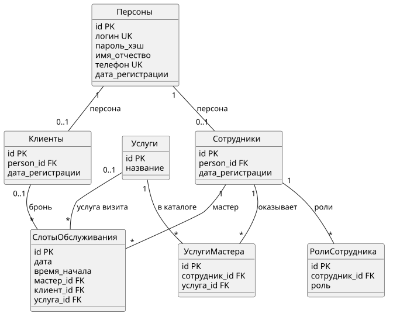
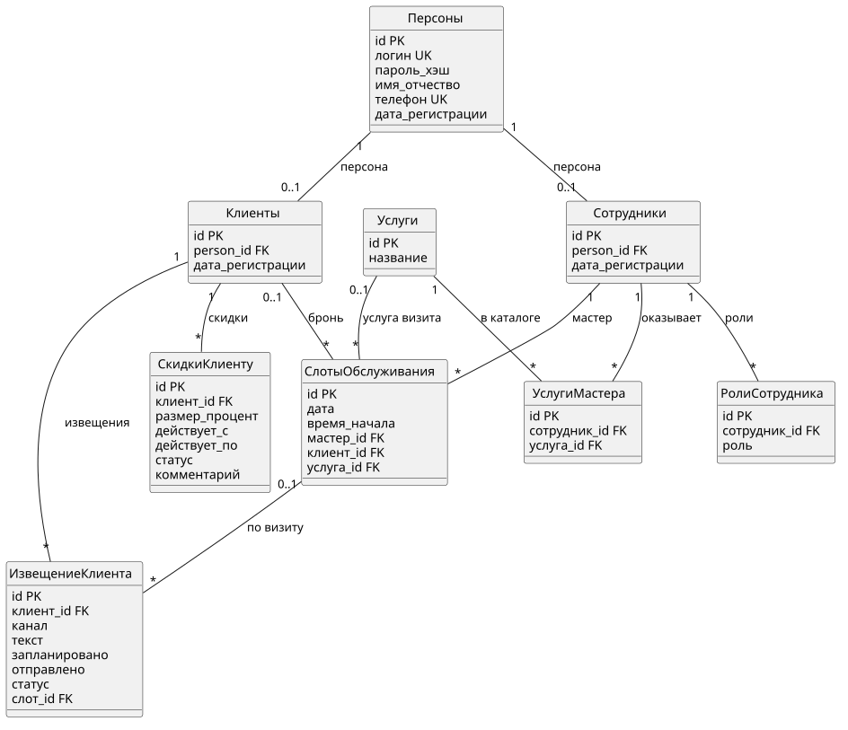

## Exercise 00 — Класс «Персоны»

### 1. Назначение класса «Персоны»

Класс **«Персоны»** — базовая сущность, где хранятся данные человека для входа в систему (логин/пароль) и контакты, по которым с ним связываются (в первую очередь телефон).

Если смотреть на сценарии **UC01–UC04**, то видно, что:

- **UC01** и **UC04** требуют телефон и имя, проверяют, что телефон ещё не зарегистрирован, и передают клиенту логин/пароль через СМС.
- **UC02** и **UC03** опираются на номер телефона для отправки СМС-напоминаний и уведомлений об изменениях.
- В этом проекте «Персоны» выступают общим слоем «человек в системе», а дальше от него наследуются специализации (**«Клиенты»** и **«Сотрудники»** в Exercise 01).

### 2–3. Атрибуты и параметры

| № | Наименование | Ключ | Тип данных | Ограничение длины (текст) | Обязательность | Значение по умолчанию | Комментарии |
|---|----------------|------|------------|---------------------------|----------------|------------------------|-------------|
| 1 | Идентификатор персоны | **PK** | `BIGINT` или `UUID` | — | Да | Нет (генерация при создании) | Суррогатный ключ; цель связи 1:1 с «Клиенты» / «Сотрудники». |
| 2 | Логин | **UK** | `VARCHAR` | 50–64 | Да | Нет | Уникальное имя входа; в UC упоминается в СМС. |
| 3 | Пароль (хэш) | — | `VARCHAR` | 255 | Да | Нет | Хранить хэш (bcrypt/argon2), не открытый пароль. UC04 — временный пароль задаётся при регистрации. |
| 4 | Имя (отчество) | — | `VARCHAR` | 100 | Да* | NULL | *Обращения в интерфейсе и СМС; уточнить обязательность отчества в команде. |
| 5 | Номер телефона | **UK** | `VARCHAR` | 20 | Да | Нет | Уникальность по UC01/UC04; E.164 или с кодом страны; SMS и дозвоны. |
| 6 | Дата регистрации | — | `TIMESTAMP WITH TIME ZONE` | — | Да | `CURRENT_TIMESTAMP` при создании записи | Момент успешной регистрации. |

**Внешние ключи:** у «Персоны» в объёме Ex. 00 нет; на персону ссылаются «Клиенты» и «Сотрудники».

---

## Exercise 01 — Сущности «Клиенты», «Сотрудники»

### Клиенты

**Назначение:** это запись о клиенте сети барбершопов — по ней оформляется бронирование услуги (UC03), хранится регистрация (UC01, UC04), и через неё приходят СМС, а также остаются отзывы. Связь с **Персоной** 1:1 нужна, чтобы логин/телефон/имя хранились в «Персоны».

| Наименование | Ключ | Тип данных | Длина (текст) | Обязательность | Значение по умолчанию | Комментарии |
|--------------|------|------------|---------------|----------------|------------------------|-------------|
| Идентификатор записи клиента | **PK** | `BIGINT` | — | Да | Нет (генерация) | Суррогатный ключ сущности «Клиенты». |
| Идентификатор персоны | **FK → Персоны.id** | `BIGINT` / `UUID` | — | Да | Нет | Связь 1:1 с персоной; один клиент — одна персона. |
| Дата регистрации | — | `TIMESTAMP WITH TIME ZONE` | — | Да | `CURRENT_TIMESTAMP` | Может дублировать смысл даты в «Персоны»; фиксация роли «клиент» в системе — по условию задания. |

### Сотрудники

**Назначение:** это сотрудник барбершопа (мастер, менеджер и т. д.). Через него реализуются UC02 (расписание и слоты), выбор услуг мастера, а также отчётность и работа с клиентами в ручном режиме. Роль уточняется справочником «Роли сотрудника» (Ex. 02). Связь с **Персоной** 1:1 — общие данные о человеке.

| Наименование | Ключ | Тип данных | Длина (текст) | Обязательность | Значение по умолчанию | Комментарии |
|--------------|------|------------|---------------|----------------|------------------------|-------------|
| Идентификатор записи сотрудника | **PK** | `BIGINT` | — | Да | Нет (генерация) | Суррогатный ключ сущности «Сотрудники». |
| Идентификатор персоны | **FK → Персоны.id** | `BIGINT` / `UUID` | — | Да | Нет | Связь 1:1; сотрудник входит в систему как персона. |
| Дата регистрации | — | `TIMESTAMP WITH TIME ZONE` | — | Да | `CURRENT_TIMESTAMP` | Дата оформления записи «сотрудник» — по условию задания. |

**Замечание:** один человек не может быть одновременно клиентом и сотрудником без отдельного бизнес-правила (две персоны или смена роли) — зафиксировать на уровне команды.

---

## Exercise 02 — Справочники: «Роли сотрудника», «Услуги», «Услуги мастера»

### Роли сотрудника

**Назначение:** хранит роли, которые назначены сотруднику (например, мастер или менеджер). Эти роли нужны для UC02, чтобы система могла выбрать подходящего мастера при выборе слота, и для логики работы: менеджер ведёт расписание, мастер смотрит свои записи.

| Наименование | Тип данных | Длина | Обязательность | Значение по умолчанию / пустое | Комментарии |
|--------------|------------|-------|----------------|--------------------------------|-------------|
| Идентификатор записи | `BIGINT` | — | Да | Нет | **PK**. |
| Сотрудник | `BIGINT` | — | Да | Нет | **FK → Сотрудники**; один сотрудник может иметь несколько ролей (несколько строк). |
| Роль | перечисление / `VARCHAR` | 20 | Да | Нет | Значения: `мастер`, `менеджер`; допускается `CHECK` или справочник кодов. |

### Услуги

**Назначение:** справочник услуг барбершопа. Клиент выбирает услугу при бронировании (UC03), а менеджер поддерживает этот каталог в актуальном состоянии.

| Наименование | Тип данных | Длина | Обязательность | Значение по умолчанию / пустое | Комментарии |
|--------------|------------|-------|----------------|--------------------------------|-------------|
| Идентификатор записи | `BIGINT` | — | Да | Нет | **PK**. |
| Название услуги | `VARCHAR` | 200 | Да | Нет | Уникальность названия — по политике команды (опционально **UK**). |

### Услуги мастера

**Назначение:** связывает мастера с услугами, которые он оказывает. По этой информации в UC03 формируются допустимые услуги и, в итоге, мастера для конкретного бронирования.

| Наименование | Тип данных | Длина | Обязательность | Значение по умолчанию / пустое | Комментарии |
|--------------|------------|-------|----------------|--------------------------------|-------------|
| Идентификатор записи | `BIGINT` | — | Да | Нет | **PK**. |
| Идентификатор сотрудника | `BIGINT` | — | Да | Нет | **FK → Сотрудники**; сотрудник с ролью мастер. |
| Идентификатор услуги | `BIGINT` | — | Да | Нет | **FK → Услуги**; пара (сотрудник, услуга) уникальна (**UK** составной). |

---

## Exercise 03 — Сущность «Слоты обслуживания»

**Назначение:** это единица расписания: интервал 1 час с датой и временем начала, закреплённый за конкретным мастером. Когда клиент бронирует визит, слот связывается с клиентом и (при необходимости) с услугой (в этой версии услуга добавлена как атрибут).

### Атрибуты (минимум по заданию + логичное дополнение для UC03)

| Наименование | Тип данных | Длина (текст) | Обязательность | Значение по умолчанию | Комментарии |
|--------------|------------|---------------|----------------|------------------------|-------------|
| Идентификатор записи | `BIGINT` | — | Да | Нет | **PK**. |
| Дата | `DATE` | — | Да | Нет | День слота. |
| Время начала слота | `TIME` | — | Да | Нет | Начало 1-часового интервала. |
| Мастер | `BIGINT` | — | Да | Нет | **FK → Сотрудники** (роль мастер). |
| Клиент | `BIGINT` | — | Нет | NULL | **FK → Клиенты**; NULL = свободный слот, NOT NULL = бронь. |
| Услуга *(рекомендуемое дополнение)* | `BIGINT` | — | Нет | NULL | **FK → Услуги**; заполняется при бронировании (UC03 п. 10). |

**Комментарий:** уникальность пары (дата, время начала, мастер) предотвращает двойное бронирование одного слота.

---

## Exercise 04 — Диаграмма классов (UML)

### Текстовое описание связей и мощностей

- **Персоны** 1 — 0..1 **Клиенты**: у одной персоны может быть максимум один профиль клиента.
- **Персоны** 1 — 0..1 **Сотрудники**: у одной персоны может быть максимум один профиль сотрудника (если в команде так задана политика).
- **Сотрудники** 1 — * **Роли сотрудника**: у сотрудника может быть несколько ролей.
- **Сотрудники** 1 — * **Услуги мастера** — * **Услуги**: связь «многие-ко-многим» реализована через класс «Услуги мастера».
- **Сотрудники** 1 — * **Слоты обслуживания** (как мастер); **Клиенты** 0..1 — * **Слоты** (как бронирующий клиент).

### Диаграмма 

---

## Exercise 05 — «Скидки клиенту», «Извещение клиента»

### Скидки клиенту

**Назначение:** учёт персональных скидок клиента (программа лояльности, акции): у них есть период действия и размер. Дальше они учитываются при расчёте оплаты (логика менеджера из задачи 1).

**Атрибуты и параметры:**

| Наименование | Ключ | Тип данных | Длина | Обязательность | По умолчанию | Комментарии |
|--------------|------|------------|-------|----------------|--------------|-------------|
| Идентификатор | PK | `BIGINT` | — | Да | Нет | |
| Клиент | FK | `BIGINT` | — | Да | Нет | → Клиенты |
| Размер скидки, % | — | `NUMERIC(5,2)` | — | Да | Нет | 0–100 |
| Действует с | — | `DATE` | — | Да | Нет | |
| Действует по | — | `DATE` | — | Нет | NULL | NULL = бессрочно до отмены |
| Статус | — | `VARCHAR` | 20 | Да | `активна` | активна / отменена / истекла |
| Комментарий | — | `VARCHAR` | 500 | Нет | NULL | основание скидки |

### Извещение клиента

**Назначение:** исходящие сообщения клиенту по каналам (в задаче 1: Telegram, WhatsApp, VK, СМС). По ним отправляются напоминания, подтверждения брони и уведомления об изменении визита (UC02, UC03).

**Атрибуты и параметры:**

| Наименование | Ключ | Тип данных | Длина | Обязательность | По умолчанию | Комментарии |
|--------------|------|------------|-------|----------------|--------------|-------------|
| Идентификатор | PK | `BIGINT` | — | Да | Нет | |
| Клиент | FK | `BIGINT` | — | Да | Нет | → Клиенты; адресат по телефону/привязкам каналов |
| Канал | — | `VARCHAR` | 20 | Да | Нет | telegram, whatsapp, vk, sms |
| Текст сообщения | — | `VARCHAR` | 4000 | Да | Нет | |
| Запланировано на | — | `TIMESTAMP WITH TIME ZONE` | — | Да | Нет | расписание менеджера |
| Отправлено в | — | `TIMESTAMP WITH TIME ZONE` | — | Нет | NULL | заполняется после отправки |
| Статус | — | `VARCHAR` | 20 | Да | `ожидает` | ожидает / отправлено / ошибка |
| Связанный слот | FK | `BIGINT` | — | Нет | NULL | → Слоты обслуживания при привязке к визиту |

---

## Exercise 06 — Актуализация диаграммы классов

К диаграмме из Ex. 04 добавляются связи для:

- **Клиенты** 1 — * **Скидки клиенту**: у одного клиента может быть много скидок (разные периоды, история).
- **Клиенты** 1 — * **Извещение клиента**: у клиента много уведомлений.
- **Слоты обслуживания** 0..1 — * **Извещение клиента**: уведомление может относиться к конкретному визиту (слоту) или быть без привязки (например, сервисное сообщение).

### Полная диаграмма классов

