# Chapter V — Задача 1 «Запись на стрижку» (Ex. 00–06)

## Exercise 00 — Выбор формы представления продукта

### Таблица 0.1. Форма представления продукта

| № | Аспект | Решение |
|---|--------|---------|
| 1 | **Устройства** | **ПК/ноутбук** (браузер, от 1280×720): менеджер — полный функционал, отчёты, ввод расписания. **Планшет** (адаптив): мастер — расписание и отзывы. **Смартфон** (адаптивный веб / PWA): клиент — запись, напоминания, отзыв; менеджер — ограниченно (связь с клиентом, срочные правки). |
| 2 | **Тип программного продукта** | **Корпоративная веб-система** с публичной клиентской зоной: внутренние роли (менеджер, мастер) и внешний пользователь (клиент). Не маркетплейс и не игра. |
| 3 | **Способы управления** | **Мышь**, **клавиатура** (Tab, стандарт браузера), **сенсор** на мобильных и планшетах. Голос и джойстик не требуются. |
| 4 | **Потребности локализации** | **Язык:** русский (основной); опционально английский. **Регион/часовой пояс:** по филиалу сети. **Форматы:** дата/время, телефон, валюта по локали. **Каналы уведомлений:** Telegram, WhatsApp, VK, SMS — выбор клиентом. |

**Дополнительно (вне обязательных пунктов Ex.00):** доступность — контраст, масштаб шрифта в браузере, подписи к полям (в рамках веб-стандартов).

---

## Exercise 01 — Экранные формы классификаторов и справочников

### 1. Перечень классификаторов и справочников

| № | Наименование | Тип | Связанные справочники/классификаторы, нужные для заполнения |
|---|--------------|-----|-------------------------------------------------------------|
| 1 | **Справочник услуг** | Справочник | Классификатор категорий услуг (опц.); связь с мастерами через «Услуги мастера» |
| 2 | **Справочник сотрудников** | Справочник | Классификатор ролей сотрудника; привязка к филиалу (если есть) |
| 3 | **Классификатор ролей сотрудника** | Классификатор | — |
| 4 | **Справочник «Услуги мастера»** (связь мастер–услуга) | Справочник | Сотрудники (роль «Мастер»), Справочник услуг |
| 5 | **Классификатор статусов записи** | Классификатор | — |
| 6 | **Классификатор каналов напоминаний** | Классификатор | — |
| 7 | **Классификатор способов оплаты** | Классификатор | — |
| 8 | **Справочник филиалов сети** (при мультифилиальности) | Справочник | — |

### 2. Макеты (текстовые эскизы) экранных форм

#### 2.1. Справочник «Услуги» — форма списка

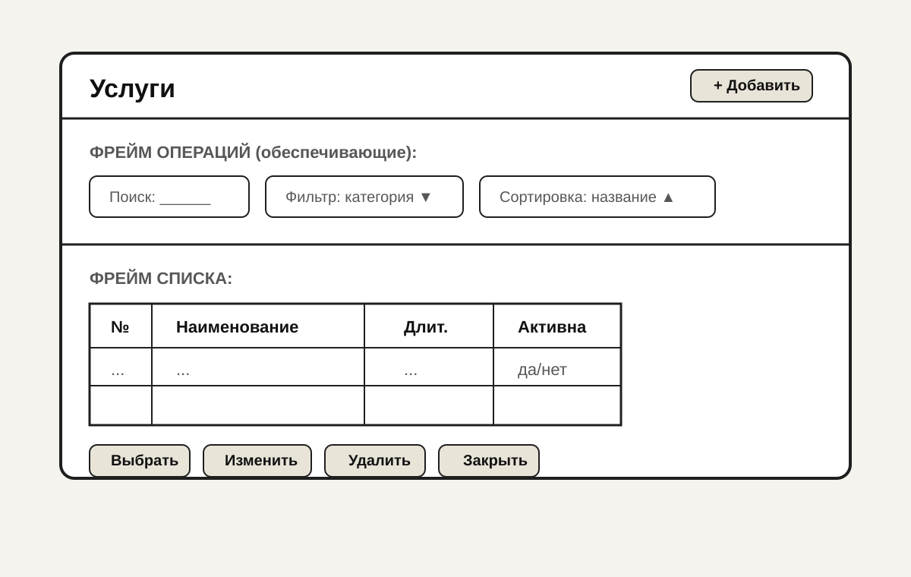

- **Вызовы:** двойной клик / «Изменить» → карточка; «+ Добавить» → новая карточка; «Закрыть» → выход без сохранения несохранённой карточки (если открыта — подтверждение).

#### 2.2. Классификатор «Роли сотрудника» — форма списка

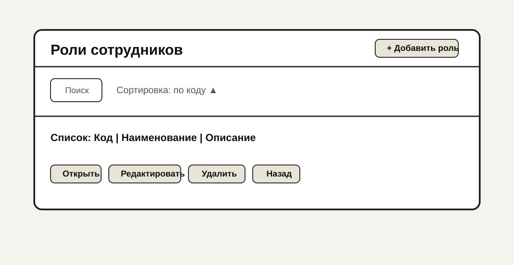

Остальные справочники и классификаторы из п. 1 используют **ту же структуру** «список + панель операций + карточка»; отличаются полями списка и карточки.

| Объект | Фрейм списка (ключевые колонки) | Фрейм операций | Переход в карточку |
|--------|----------------------------------|----------------|---------------------|
| Статусы записи | Код, название, порядок | Поиск, сортировка по коду | Двойной клик / Изменить |
| Каналы напоминаний | Код (Telegram, …), активность | Фильтр | Редактирование настроек шаблона (опц.) |
| Способы оплаты | Код, название | Сортировка | Карточка |
| Филиалы | Название, адрес, часовой пояс | Поиск по городу | Карточка |
| Сотрудники | ФИО, телефон, роль | Фильтр по роли, поиск | Карточка сотрудника |
| Услуги мастера | Мастер, услуга | Фильтр по мастеру | Добавить/удалить связь |

#### 2.3. Структура макета для остальных объектов п.1 (без отдельного рисунка)

Для **каждого** перечисленного ниже объекта форма списка устроена одинаково: **заголовок** (название справочника) → **фрейм операций** (поиск, фильтр, сортировка, «Добавить») → **фрейм списка** (таблица) → **панель действий** (Выбрать / Изменить / Удалить / Закрыть / Назад).

| № | Классификатор / справочник | Название в шапке экрана | Фрейм списка (содержание) | Фрейм операций (основные + обеспечивающие) | Далее | Отказ |
|---|----------------------------|-------------------------|---------------------------|---------------------------------------------|-------|--------|
| 3 | Роли сотрудника | «Роли сотрудников» | Таблица: код, наименование, описание | Поиск по коду/названию; сортировка по коду ↑; «+ Добавить» | Двойной клик / «Изменить» → карточка | «Закрыть» / «Назад» без сохранения карточки — подтверждение |
| 5 | Статусы записи | «Статусы записи» | Код, название, порядок отображения | Поиск; сортировка по коду; фильтр «активен» | → карточка статуса | Закрыть |
| 6 | Каналы напоминаний | «Каналы напоминаний» | Код канала, активен, шаблон (опц.) | Фильтр «активен»; поиск по коду | → настройки шаблона уведомления | Отмена |
| 7 | Способы оплаты | «Способы оплаты» | Код, название, активен | Сортировка по названию | → карточка | Назад |
| 8 | Филиалы | «Филиалы сети» | Название, город, часовой пояс | Поиск по городу/названию; фильтр региона | → карточка филиала | Закрыть |
| 2 | Сотрудники | «Сотрудники» | ФИО, телефон, роль, филиал | Фильтр: роль, филиал; поиск по ФИО/телефону; частичное совпадение | → карточка сотрудника | Закрыть |
| 4 | Услуги мастера | «Услуги мастера» | Мастер, услуга, активна связь | Фильтр по мастеру и услуге | «Добавить связь» / удаление строки | Отмена при несохранённой карточке связи |

**Вызовы (общие):** «Добавить» → пустая карточка; «Изменить» / двойной клик → карточка записи; «Удалить» → подтверждение при наличии ссылок из других сущностей; «Закрыть» → выход из формы списка.

### 3. Основные операции (классификаторы и справочники)

| Объект | Операция | Менеджер | Мастер | Клиент | Условия | Результат в объекте | Результат в системе |
|--------|----------|----------|--------|--------|---------|---------------------|---------------------|
| Услуги | Просмотр списка | R | — | — | — | Список актуальных услуг | — |
| Услуги | Создание/изменение/удаление | RW | — | — | Удаление: нет активных будущих записей на услугу | Запись в справочнике | Обновление списков при записи клиента |
| Роли сотрудника | Изменение | R (просмотр), настройка — админ/менеджер по политике | — | — | Нельзя удалить роль, назначенную сотрудникам | Справочник ролей | Влияет на выбор при вводе слотов |
| Сотрудники | CRUD | RW | R (своя карточка — по политике) | — | Уникальность телефона/логина | Справочник | Назначение мастера на слот |
| Услуги мастера | Назначение услуг мастеру | RW | — | — | Мастер должен иметь роль «Мастер» | Связи | Фильтрация мастеров в UC03 |
| Статусы записи | Просмотр, редактирование справочника | RW | — | — | Нельзя удалить статус, если есть записи с этим статусом | Классификатор | Отображение в списках записей |
| Каналы напоминаний | Включение/выключение, шаблоны | RW | — | — | Код канала уникален | Справочник настроек | Отправка напоминаний клиенту |
| Способы оплаты | CRUD | RW | — | — | Нельзя удалить способ, если есть оплаты | Классификатор | Выбор на SCR-MN-03 |
| Филиалы | CRUD | RW | — | — | Нельзя удалить филиал с активными записями (политика) | Справочник | Фильтры отчётов, запись клиента |

### 4. Обеспечивающие операции

| Операция | Объект | Сортировка (поля, умолчание) | Фильтрация (поля) | Сохранение фильтра | Поиск (поля) | Точность поиска | Сообщение при пустом результате | Дублирование при добавлении | Итоги в списке |
|----------|--------|------------------------------|-------------------|-------------------|--------------|-----------------|--------------------------------|------------------------------|----------------|
| Сортировка | Услуги | Наименование, А↑ | Категория, «Активна» | В сессии пользователя; опция «Запомнить для справочника» | Наименование, код | Подстрока, без учёта регистра | «Записи не найдены…» | «Копировать из» выбранной услуги | Число строк, суммарная длительность (опц.) |
| Сортировка | Сотрудники | ФИО А↑ | Роль, филиал | В сессии | ФИО, телефон | Частичное по ФИО; телефон — по цифрам | «Сотрудники не найдены» | — | Кол-во записей в выборке |
| Сортировка | Статусы записи | Код А↑ | «Только активные» | В сессии | Код, название | Префикс/подстрока | «Нет статусов по фильтру» | — | — |
| Сортировка | Филиалы | Название А↑ | Город, регион | В сессии | Название, адрес | Подстрока | «Филиалы не найдены» | — | — |
| Сортировка | Услуги мастера | Мастер А↑, услуга А↑ | Мастер, услуга | В сессии | ФИО мастера, название услуги | Частичное | «Связей не найдено» | Копировать набор услуг с другого мастера (опц.) | Кол-во связей |
| Сообщение «нет данных» | Все списки | — | — | — | — | — | Единый текст: «Записи не найдены. Измените фильтр или поиск.» | — | — |

### 5. Логирование (классификаторы/справочники)

| Операции для журнала | Атрибуты объекта | Служебные поля журнала |
|----------------------|------------------|-------------------------|
| Создание, изменение, удаление записи справочника; изменение связей «мастер–услуга» | ID записи, ключевые поля (наименование, код), старые/новые значения (по политике) | Дата/время (UTC+смещение филиала), пользователь (логин), тип операции, IP (опц.) |

### 6. Сводная таблица по формам справочников

| Форма | Основные операции | Кто вызывает | Логирование |
|-------|-------------------|--------------|-------------|
| Услуги (список/карточка) | CRUD | Менеджер | Да |
| Сотрудники | CRUD, назначение роли | Менеджер | Да |
| Роли сотрудника | Просмотр, редко редактирование | Менеджер/админ | Да |
| Услуги мастера | Назначение/снятие | Менеджер | Да |
| Статусы записи | Просмотр, CRUD | Менеджер | Да |
| Каналы напоминаний | Настройка | Менеджер | Да |
| Способы оплаты | CRUD | Менеджер | Да |
| Филиалы | CRUD | Менеджер | Да |

---

## Exercise 02 — Данные на экранных формах классификаторов и справочников

### Таблица 2.1. Справочник «Услуга» — форма списка

| Краткое имя поля | Описание | Тип | Длина | Обяз. | По умолчанию | Неопределённое значение | Выход за экран | Выбор из справочника | Проверки | Сообщения |
|------------------|----------|-----|-------|-------|--------------|---------------------------|----------------|----------------------|----------|-----------|
| Код | Внутренний код | Строка | 20 | Да | Авто | «—» | Обрезка + tooltip | — | Уникальность | «Код занят» |
| Наименование | Название услуги | Строка | 200 | Да | — | Пусто не допускается | Перенос/… | — | Не пусто | «Введите наименование» |
| Длительность | Минуты | Число | — | Да | 60 | — | — | — | >0, кратно 15 (политика) | «Укажите длительность >0» |
| Активна | Участвует в записи | Булево | — | Да | Да | — | — | — | — | — |

### Таблица 2.2. Справочник «Сотрудник» — форма списка (те же подпункты ex.02 п.1.3)

| Краткое имя поля | Описание | Тип | Длина | Обяз. | По умолчанию | Неопределённое значение | Выход за экран | Выбор из справочника | Проверки | Сообщения |
|------------------|----------|-----|-------|-------|--------------|---------------------------|----------------|----------------------|----------|-----------|
| ФИО | Отображаемое имя | Строка | 150 | Да | — | «—» | Перенос / обрезка + tooltip | — | Не пусто | «Укажите ФИО» |
| Телефон | Учётная связь / логин | Строка | 20 | Да | — | Маска пустая | Горизонтальная прокрутка запрещена — перенос невозможен, только маска | — | Формат РФ, уникальность | «Неверный телефон» / «Номер занят» |
| Роль | Роль сотрудника | Ссылка | — | Да | — | «Не задано» | — | Классификатор ролей | Обязательна для сценариев с мастером | «Выберите роль» |
| Филиал | Привязка к точке | Ссылка | — | Нет | Основной филиал сети | «—» | — | Справочник филиалов | Если мультифилиальность включена | — |

### Таблица 2.3. Классификатор «Роли сотрудника» — форма списка

| Краткое имя поля | Описание | Тип | Длина | Обяз. | По умолчанию | Неопределённо | За экраном | Из справочника | Проверки | Сообщения |
|------------------|----------|-----|-------|-------|--------------|---------------|------------|----------------|----------|-----------|
| Код | Системный код роли | Строка | 20 | Да | — | — | … | — | Уникальность, латиница/цифры | «Код занят» |
| Наименование | Отображаемое имя | Строка | 100 | Да | — | — | Перенос | — | Не пусто | «Введите наименование» |
| Описание | Подсказка в UI | Строка | 500 | Нет | — | Пусто — не показывать блок | Многострочный ввод, перенос | — | Макс. длина | «Слишком длинное описание» |

### Таблица 2.4. Классификатор «Статус записи» — форма списка

| Краткое имя поля | Описание | Тип | Длина | Обяз. | По умолчанию | Неопределённо | За экраном | Из справочника | Проверки | Сообщения |
|------------------|----------|-----|-------|-------|--------------|---------------|------------|----------------|----------|-----------|
| Код | Системный код | Строка | 20 | Да | — | — | … | — | Уникальность, латиница | «Код занят» |
| Наименование | Показ пользователю | Строка | 100 | Да | — | — | Перенос | — | Не пусто | «Введите название» |
| Порядок | Сортировка в списках | Число | — | Да | 0 | — | — | — | ≥ 0 | «Некорректный порядок» |

### Таблица 2.5. Классификатор «Способ оплаты» — форма списка

| Краткое имя поля | Описание | Тип | Длина | Обяз. | По умолчанию | Неопределённо | За экраном | Из справочника | Проверки | Сообщения |
|------------------|----------|-----|-------|-------|--------------|---------------|------------|----------------|----------|-----------|
| Код | Код способа | Строка | 20 | Да | — | — | … | — | Уникальность | «Код занят» |
| Наименование | Название в UI | Строка | 80 | Да | — | — | Перенос | — | Не пусто | «Введите название» |
| Активен | Доступен для выбора | Булево | — | Да | Да | — | — | — | — | — |

### Таблица 2.6. Справочник «Филиал» — форма списка

| Краткое имя поля | Описание | Тип | Длина | Обяз. | По умолчанию | Неопределённо | За экраном | Из справочника | Проверки | Сообщения |
|------------------|----------|-----|-------|-------|--------------|---------------|------------|----------------|----------|-----------|
| Название | Краткое имя точки | Строка | 120 | Да | — | — | Перенос | — | Не пусто | «Введите название» |
| Город | Для фильтров | Строка | 80 | Нет | — | «—» | … | — | — | — |
| Часовой пояс | IANA / смещение | Строка | 50 | Да | Europe/Moscow | — | — | — | Из допустимого списка | «Выберите часовой пояс» |

### Таблица 2.7. Справочник «Услуги мастера» — форма списка (связь)

| Краткое имя поля | Описание | Тип | Длина | Обяз. | По умолчанию | Неопределённо | За экраном | Из справочника | Проверки | Сообщения |
|------------------|----------|-----|-------|-------|--------------|---------------|------------|----------------|----------|-----------|
| Мастер | Сотрудник-мастер | Ссылка | — | Да | — | — | — | Сотрудники (роль Мастер) | Один мастер | «Выберите мастера» |
| Услуга | Услуга из справочника | Ссылка | — | Да | — | — | — | Услуги | Пара «мастер+услуга» уникальна | «Связь уже существует» |

### Таблица 2.8. Классификатор «Каналы напоминаний» — ключевые поля

| Краткое имя поля | Описание | Тип | Длина | Обяз. | По умолчанию | Неопределённо | За экраном | Проверки | Сообщения |
|------------------|----------|-----|-------|-------|--------------|---------------|------------|----------|-----------|
| Код канала | telegram, sms, … | Строка | 20 | Да | — | — | … | Уникальность | «Код занят» |
| Активен | Участвует в выборе клиента | Булево | — | Да | Да | — | — | — | — |

### Потребности пагинации и агрегатов

| Форма / справочник | Пагинация | Агрегаты (ex.02 п.2.2) |
|--------------------|-----------|-------------------------|
| Услуги, сотрудники, филиалы, услуги мастера | Да: 20/50/100 на страницу, номера страниц | Количество записей в выборке; для услуг — сумма длительностей (опц.) |
| Статусы, способы оплаты, каналы (мало строк) | Пагинация опциональна (все на одной странице) | Количество активных строк |

### Проверки при вводе (общие)

- Дубликат телефона сотрудника/клиента — блокирующее сообщение.
- Удаление услуги при наличии будущих записей — запрет или перенос на другую услугу (политика: **запрет с сообщением**).
- Удаление филиала/статуса/способа оплаты при наличии ссылок из операционных данных — блокировка с пояснением.

---

## Exercise 03 — Ключевые сценарии ролей

### 1. Ключевые сценарии основных процессов

**Менеджер**

1. Ведение справочников (услуги, сотрудники, услуги мастеров).
2. Формирование и корректировка расписания (слоты мастеров).
3. Регистрация клиента по телефону (UC04).
4. Ручная связь с клиентом, отметка выполнения услуги, оплата, передача данных в бухгалтерию.
5. Просмотр отчётов и отзывов.

**Мастер**

1. Просмотр расписания и записей на свои услуги.
2. Просмотр отзывов клиентов.

**Клиент**

1. Регистрация (UC01) или запись без регистрации (если допущено политикой — в ТЗ указано «может записывать и незарегистрированный»).
2. Бронирование слота (UC03): слот → услуга → мастер → подтверждение.
3. Получение напоминаний по выбранному каналу.
4. Оценка услуги и обратная связь после визита.

### 2. Схемы задач основных процессов (прямоугольники и стрелки — успешный путь)

**Менеджер: формирование слота**

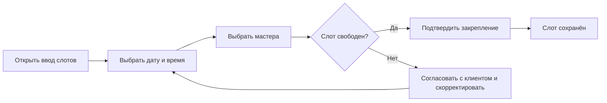

**Клиент: бронирование**

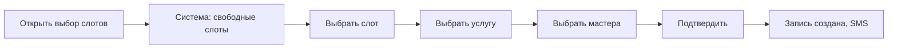

**Мастер: просмотр дня**

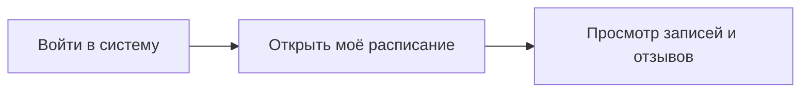

**Менеджер: ведение расписания и обслуживание записи (обобщённо)**

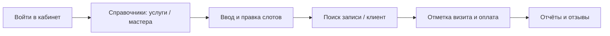

### 3. Сценарии с экранными формами (фрагмент с условиями на переходах и выходом без сохранения)

**Клиент — запись на стрижку (успех + выход)**

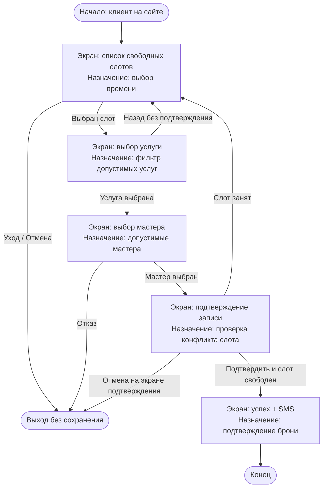

- **Выход без сохранения:** любой «Отмена»/закрытие до финального подтверждения — запись не создаётся (при необходимости — диалог «Покинуть страницу?»).

**Менеджер — основной рабочий день (экраны, успех и выход без сохранения)**

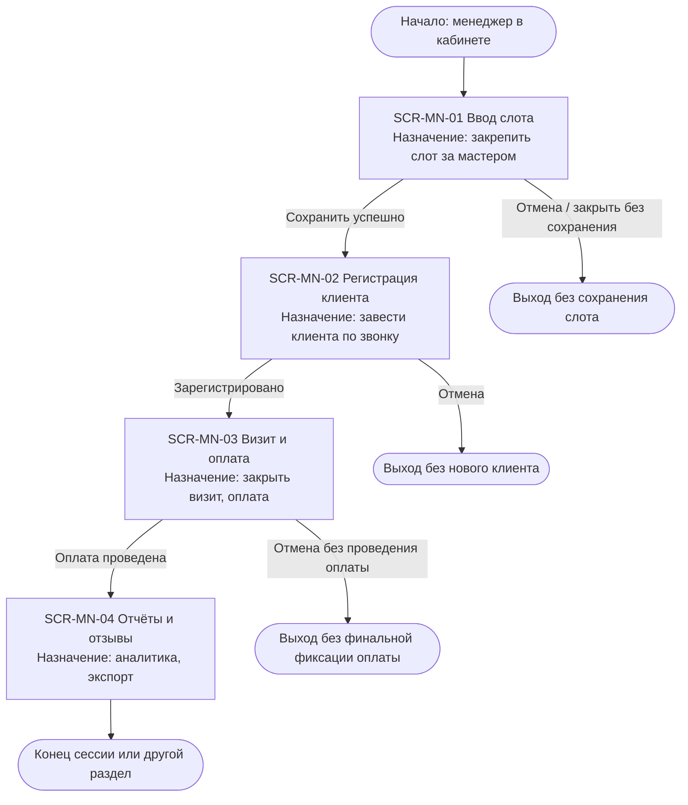

**Мастер — просмотр (экраны)**

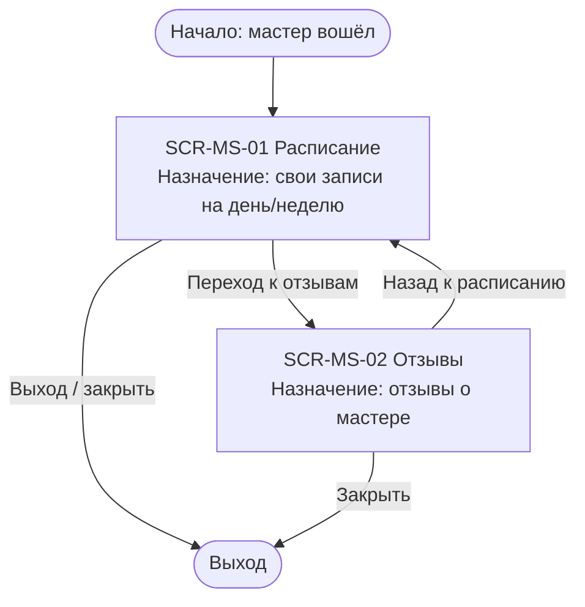

### 4. Начало и окончание

- **Начало:** событие «Клиент открыл страницу записи» / «Менеджер вошёл в кабинет» / «Мастер вошёл в кабинет».
- **Окончание:** узел «Запись создана» / «Слот сохранён» / «Оплата зафиксирована» / «Пользователь вышел без сохранения».

---

## Exercise 04 — Список экранных форм

### Таблица 4.1. Экранные формы основных процессов

| ID экрана | Роль | Главное действие | Другие действия | Данные для действия | Права ролей к данным на экране |
|-----------|------|------------------|-----------------|----------------------|--------------------------------|
| **SCR-CL-01** | Клиент | Выбор слота | Фильтр по дате/филиалу | Календарь, список слотов | Клиент: чтение свободных слотов; без ПДн других клиентов |
| **SCR-CL-02** | Клиент | Выбор услуги | Просмотр описания/цены | Допустимые услуги для слота | Чтение справочника услуг |
| **SCR-CL-03** | Клиент | Выбор мастера | Смена услуги (назад) | Мастера, прошедшие фильтр UC03 | Чтение ФИО мастера, без внутренних контактов |
| **SCR-CL-04** | Клиент | Подтверждение брони | Изменить выбор | Сводка: дата, время, услуга, мастер | Подтверждение создаёт запись |
| **SCR-CL-05** | Клиент | Регистрация | Вход существующего | Телефон, имя, пароль | Запись только своих данных |
| **SCR-CL-06** | Клиент | Оценка и отзыв | Пропустить | ID визита, оценка, текст | Только свой завершённый визит |
| **SCR-MN-01** | Менеджер | Ввод слота мастера | Массовое копирование недели (опц.) | Дата, время, мастер | RW слотов филиала |
| **SCR-MN-02** | Менеджер | Регистрация клиента (UC04) | Поиск клиента | Телефон, имя | Создание учётной записи клиента |
| **SCR-MN-03** | Менеджер | Отметка выполнения, оплата | Печать чека (опц.) | Запись, сумма, способ оплаты | RW записей и оплат |
| **SCR-MN-04** | Менеджер | Отчёты, отзывы | Экспорт | Период, филиал | Чтение агрегатов, отзывов |
| **SCR-MS-01** | Мастер | Просмотр своего расписания | Переход к отзыву | Слоты мастера | R своих записей; без чужих ПДн |
| **SCR-MS-02** | Мастер | Просмотр отзывов | Фильтр по дате | Отзывы по визитам мастера | R отзывов о себе |

---

## Exercise 05 — Экранные формы (wireframe)

Для **каждого** экрана из таблицы 4.1: макет (ниже — **SVG wireframe**), **фреймы** главной и прочих операций, **вызовы**, **данные** (список и/или карточка), **роли**, **логирование**. Формат полей списка/карточки — по правилам ex.02 п.1.

### Таблица 5.0. Сводка по экранам (фреймы и данные)

| ID | Название формы | Фрейм главной операции | Фреймы прочих операций | Данные: список | Данные: карточка | Роли |
|----|----------------|------------------------|-------------------------|----------------|------------------|------|
| SCR-CL-01 | Свободные слоты | Выбор времени (список слотов) | Шапка: филиал, помощь; кнопка «Войти» | Таблица/список слотов | — | Клиент |
| SCR-CL-02 | Выбор услуги | Список допустимых услуг | Назад, описание услуги | Список услуг | Детали услуги (опц.) | Клиент |
| SCR-CL-03 | Выбор мастера | Список мастеров | Назад | Список мастеров | — | Клиент |
| SCR-CL-04 | Подтверждение | Итоговая сводка + «Подтвердить» | Изменить, отмена | — | Карточка итога записи | Клиент |
| SCR-CL-05 | Регистрация | Поля телефон/имя/пароль | Ссылка «Войти» | — | Карточка регистрации | Клиент |
| SCR-CL-06 | Отзыв | Оценка + комментарий | Пропустить | — | Карточка отзыва | Клиент |
| SCR-MN-01 | Слот мастера | Дата/время/мастер + сохранить | Импорт, список слотов | Таблица слотов за период | Карточка слота (при редактировании) | Менеджер |
| SCR-MN-02 | Новый клиент | Телефон, имя + зарегистрировать | Проверить в базе | — | Карточка клиента | Менеджер |
| SCR-MN-03 | Визит и оплата | Статус визита, сумма, способ оплаты | Печать, связь с клиентом | — | Карточка записи и оплаты | Менеджер |
| SCR-MN-04 | Отчёты | Период, филиал, таблица метрик | Экспорт, фильтр | Таблица показателей | — | Менеджер |
| SCR-MS-01 | Расписание мастера | Таблица записей на дату | Переход к отзывам, смена даты | Список записей | — | Мастер |
| SCR-MS-02 | Отзывы мастера | Фильтры + таблица отзывов | Назад | Список отзывов | — | Мастер |

### SCR-CL-01 — Список свободных слотов (клиент)

**Эскиз**

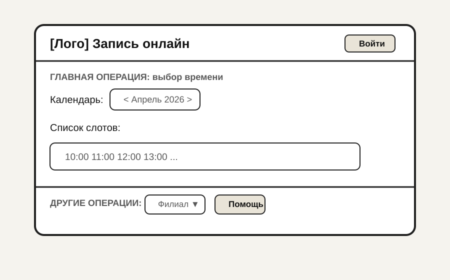

| Операция | Менеджер | Мастер | Клиент | Условие | Результат в окне | В системе |
|----------|----------|--------|--------|---------|------------------|-----------|
| Выбор слота | — | — | + | Слот свободен | Переход на SCR-CL-02 | — |
| Смена даты | — | — | + | — | Обновление списка | Запрос слотов |

**Обеспечивающие:** сортировка по времени (↑); фильтр по филиалу; поиск по дате (календарь); при пустом списке — «На выбранную дату нет свободных слотов».

**Данные (список):** объект `Слот`; пагинация по дням; поля: дата, время начала, филиал, признак свободен.

**Логирование:** просмотр слотов — по политике только аналитика (опц.); создание записи — см. Ex.06.

**Роли:** клиент (основной); менеджер/мастер не используют этот экран в типовом сценарии.

---

### SCR-CL-02 — Выбор услуги (клиент)

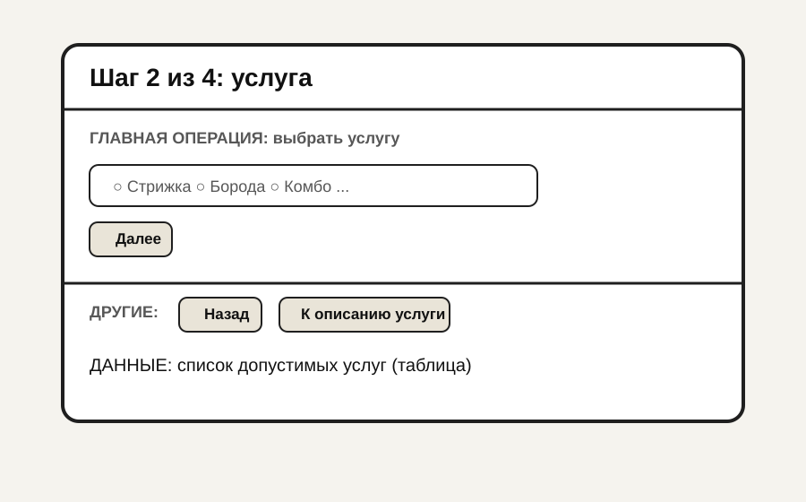

| Операция | Роли | Условие | Результат в окне | В системе |
|----------|------|---------|------------------|-----------|
| Далее | Клиент | Одна услуга выбрана | Переход на SCR-CL-03 | — |
| Назад | Клиент | — | SCR-CL-01 | — |

**Обеспечивающие:** сортировка по названию; фильтр по категории; длительность в подсказке; пустой список — «Нет услуг для выбранного времени».

**Данные:** список — `Услуга` (id, название, длительность, цена); карточка — детали услуги.

**Логирование:** изменение записи при «Далее» не выполняется; лог при создании записи на SCR-CL-04.

---

### SCR-CL-03 — Выбор мастера (клиент)

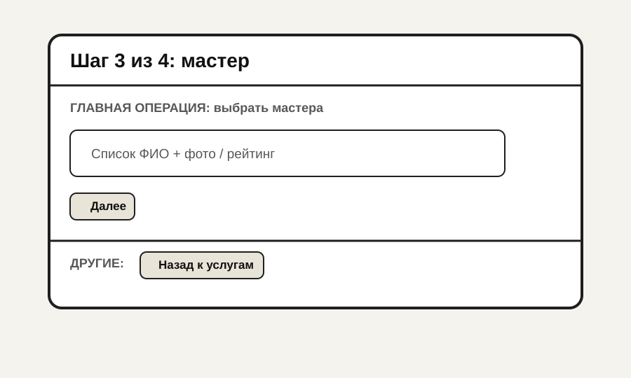

| Операция | Условие | Результат |
|----------|---------|-----------|
| Далее | Мастер выбран | Переход на SCR-CL-04 |

**Обеспечивающие:** сортировка по ФИО; поиск по имени; при отсутствии мастеров — «Нет доступных мастеров на это время».

**Данные:** список — `Мастер` (ФИО, услуги); карточка не обязательна.

---

### SCR-CL-04 — Подтверждение бронирования (клиент)

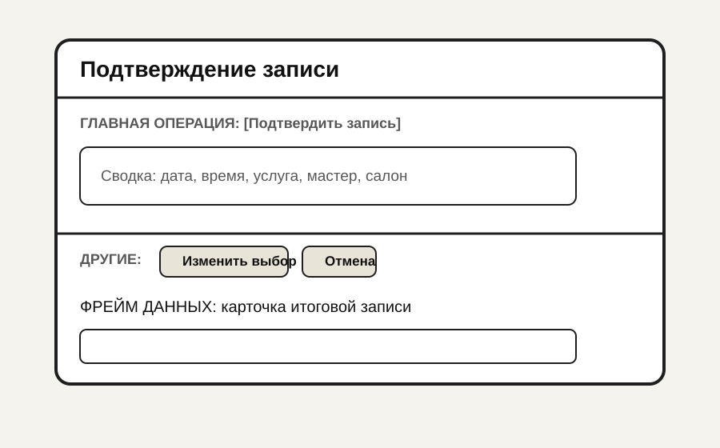

| Операция | Условие | Результат в окне | В системе |
|----------|---------|------------------|-----------|
| Подтвердить | Слот свободен | Экран успеха | Создание `Запись`, SMS |
| Подтвердить | Слот занят | Сообщение | SCR-CL-01 |
| Отмена | — | Выход без сохранения | — |

**Логирование:** успех — да (запись, SMS); конфликт — опц. Ex.06.

---

### SCR-CL-05 — Регистрация клиента (UC01)

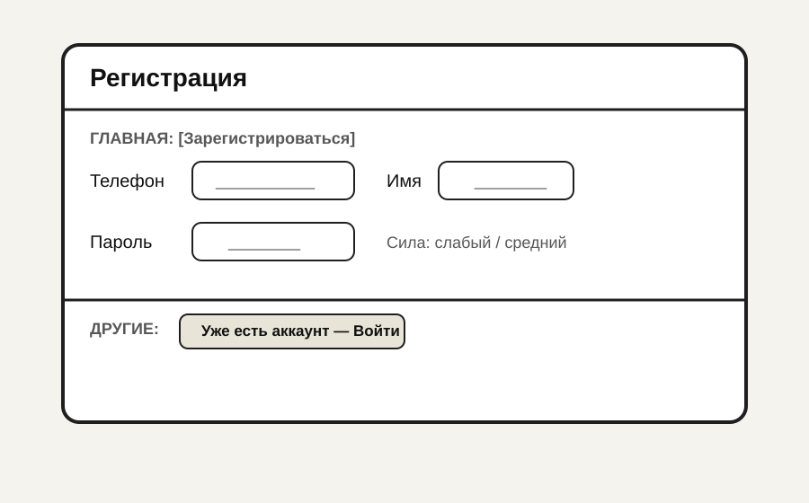

**Основные операции:** сохранение — клиент; условия: телефон свободен, пароль валиден; результат — учётная запись, SMS.

**Обеспечивающие:** маска телефона; подсказка пароля; дублирование записи при регистрации не применяется.

**Данные:** карточка `Клиент` — телефон, имя, пароль (хэш), канал напоминаний (на следующем шаге или в профиле).

**Логирование:** успешная регистрация — да; неудачная — опц. Ex.06.

---

### SCR-CL-06 — Оценка и отзыв после визита

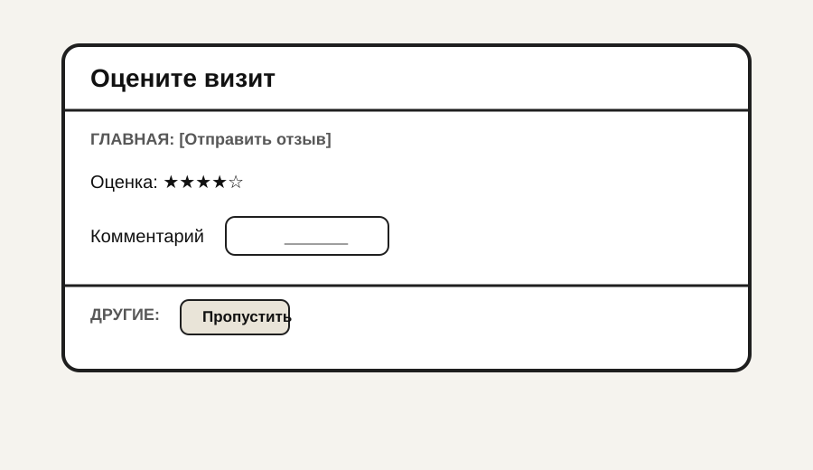

**Основные операции:** только клиент; условие: визит завершён, отзыв ещё не оставлен; результат — запись отзыва, отображение в отчётах.

**Логирование:** создание отзыва — да.

---

### SCR-MN-01 — Ввод слота мастера

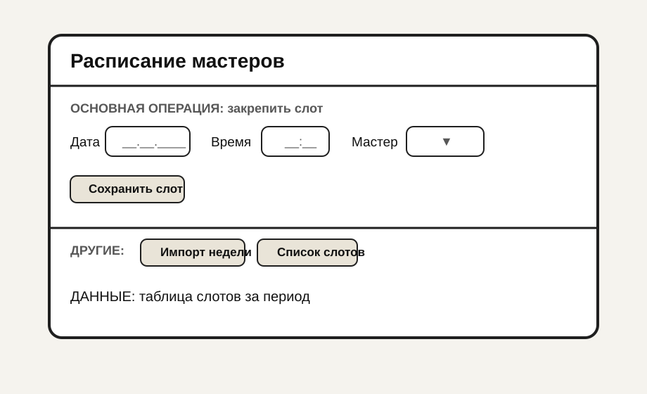

**Основные операции:** сохранение — менеджер; условие: слот не занят клиентом; иначе сообщение и сценарий UC02 (согласование).

**Логирование:** создание/изменение/удаление слота — да; атрибуты: дата, время, ID мастера, ID филиала.

**Роли:** менеджер.

---

### SCR-MN-02 — Регистрация клиента менеджером (UC04)

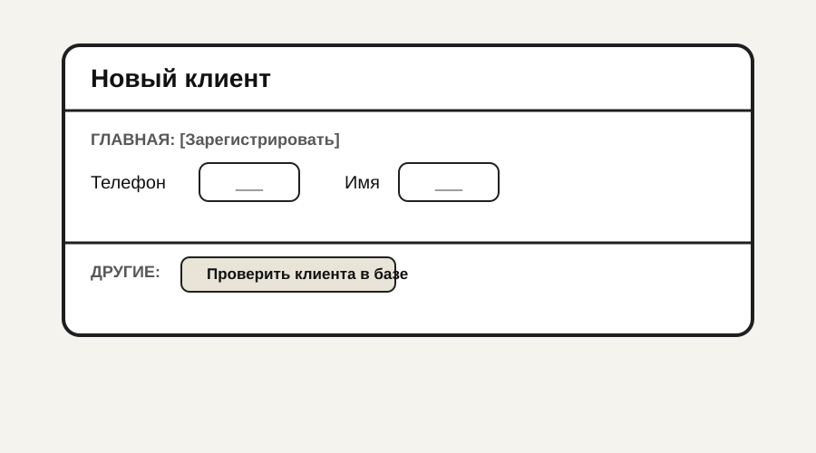

**Основные операции:** менеджер; условие: телефон не занят; результат — клиент, SMS с временным паролем (UC04).

**Логирование:** создание клиента — да.

---

### SCR-MN-03 — Выполнение услуги и оплата

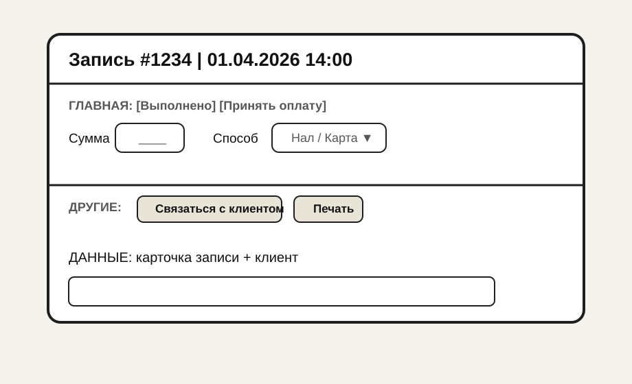

**Основные операции:** менеджер; условия: корректная сумма, способ оплаты; результат — статус визита, передача в бухгалтерию (внешняя интеграция или экспорт).

**Логирование:** да — оплата, статус, пользователь.

---

### SCR-MN-04 — Отчёты и отзывы (менеджер)

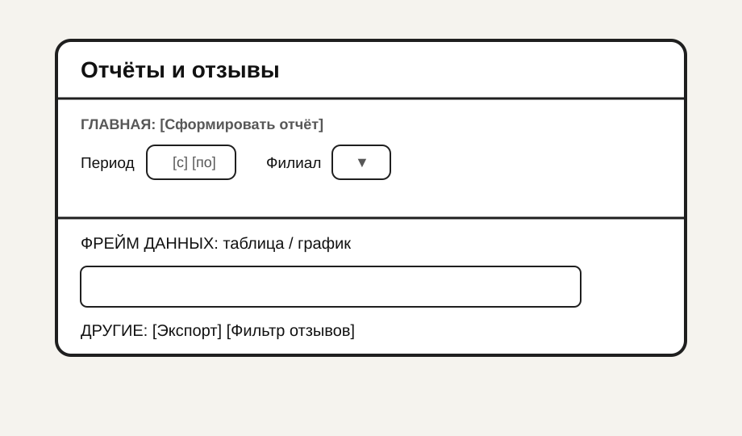

**Основные операции:** чтение агрегатов; экспорт — без изменения данных.

**Логирование:** экспорт отчёта — да (кто, период).

---

### SCR-MS-01 — Расписание мастера

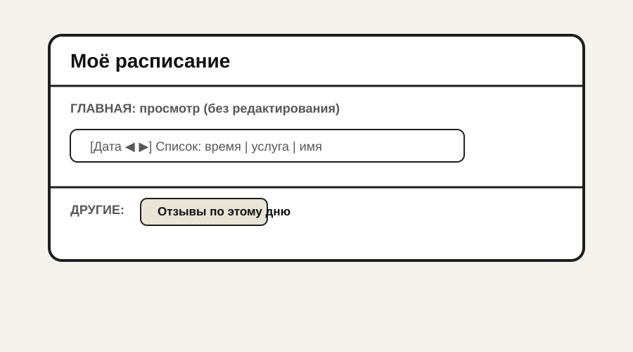

- **Главная операция:** просмотр списка записей на день/неделю.
- **Операции:** фильтр по дате; переход к отзыву.

**Данные:** объект `Запись на услугу`; список: время, клиент (инициалы/имя по политике), услуга, статус.

**Роли:** мастер (только свои записи).

**Логирование:** просмотр — опц.

---

### SCR-MS-02 — Отзывы мастера

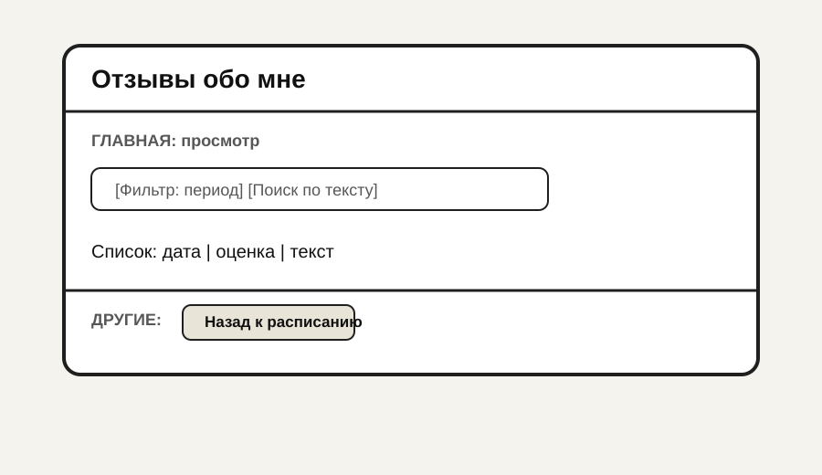

**Основные операции:** чтение отзывов, где мастер = текущий пользователь.

**Обеспечивающие:** сортировка по дате ↓; фильтр по оценке; пусто — «Отзывов пока нет».

**Логирование:** опц.

---

### Сводная таблица 5.1. Операции и логирование по экранам ввода

| Экран | Основные операции с БД | Логирование |
|-------|------------------------|-------------|
| SCR-CL-04 | Создание записи, отправка SMS | Да: факт брони, канал SMS |
| SCR-CL-05 | Регистрация клиента | Да |
| SCR-CL-06 | Создание отзыва | Да |
| SCR-MN-01 | CRUD слотов | Да |
| SCR-MN-02 | Создание клиента | Да |
| SCR-MN-03 | Оплата, статус визита | Да: финансовые операции |
| SCR-MN-04 | Экспорт отчёта | Да (экспорт) |
| SCR-MS-01, SCR-MS-02 | Чтение | Опц. |

---

### Таблица 5.2. Соответствие экранов Ex.04 и разделов Ex.05

| ID | Раздел Ex.05 |
|----|----------------|
| SCR-CL-01 … SCR-CL-06 | Отдельные подразделы выше |
| SCR-MN-01 … SCR-MN-04 | Отдельные подразделы выше |
| SCR-MS-01, SCR-MS-02 | Отдельные подразделы выше |

### Таблица 5.3. Логирование по экранам (ex.05 п.5)

| Экран | Операции, требующие логирования | Атрибуты в журнале | Служебные поля |
|-------|----------------------------------|--------------------|----------------|
| SCR-CL-04 | Успешное создание записи, конфликт слота | ID слота/записи, услуга, мастер, телефон (маскированно) | Время, пользователь/сессия, канал SMS |
| SCR-CL-05 | Успешная регистрация, отказ (дубликат телефона) | Телефон (маскированно), причина отказа | Время, IP (опц.) |
| SCR-CL-06 | Создание отзыва | ID визита, оценка, длина текста | Время, клиент |
| SCR-MN-01 | Создание/изменение/удаление слота | Дата, время, ID мастера, ID филиала | Время, менеджер |
| SCR-MN-02 | Создание клиента менеджером | Телефон (маскированно), факт SMS | Время, менеджер |
| SCR-MN-03 | Оплата, смена статуса визита | ID записи, сумма, способ оплаты | Время, менеджер |
| SCR-MN-04 | Экспорт отчёта | Период, филиал, формат файла | Время, менеджер |
| SCR-MS-01, SCR-MS-02 | Обычно без обязательного журнала | — | При политике безопасности: факт просмотра (опц.) |

---

## Exercise 06 — Описание контролей (валидация при вводе)

### Таблица 6.1. Контроли по экранам с вводом/корректировкой

| ID экрана | Роль | Главное действие | Объект данных |
|-----------|------|------------------|---------------|
| SCR-CL-01 | Клиент | Выбор даты, филиала, слота | `Слот` / контекст записи |
| SCR-CL-02 | Клиент | Выбор услуги | `Услуга` |
| SCR-CL-03 | Клиент | Выбор мастера | `Сотрудник` (мастер) |
| SCR-CL-05 | Клиент | Регистрация | `Клиент` |
| SCR-MN-02 | Менеджер | Регистрация клиента | `Клиент` |
| SCR-MN-01 | Менеджер | Слот | `Слот расписания` |
| SCR-CL-04 | Клиент | Подтверждение записи | `Запись на услугу` |
| SCR-MN-03 | Менеджер | Оплата | `Оплата` / `Запись` |
| SCR-CL-06 | Клиент | Отзыв | `Отзыв` |
| SCR-MN-04 | Менеджер | Фильтры отчёта (период, филиал), экспорт | `Отчёт` / агрегаты |

### Таблица 6.2. Детализация контролей

| Пагинация | Поле | Мнемоника | Описание контроля | Сообщение при ошибке | Результат при ошибке | Результат при успехе |
|-----------|------|-----------|-------------------|----------------------|----------------------|----------------------|
| — | Телефон | `phone` | Формат РФ, уникальность | «Неверный формат» / «Номер уже зарегистрирован» | Остаёмся на форме, поле подсвечено | Переход к паролю или сохранение |
| — | Пароль | `password` | Мин. длина, классы символов | «Слабый пароль» (информ.) / «Короткий пароль» | Блок сохранения | Регистрация |
| — | Дата слота | `slot_date` | Не в прошлом для новых слотов менеджером | «Нельзя создать слот в прошлом» | Не сохранять | Сохранение |
| — | Время слота | `slot_time` | Шаг 1 час, не пересечение с занятым | «Слот занят клиентом» | Предложить изменить | Сохранение после устранения |
| — | Подтверждение брони | `confirm` | Повторная проверка свободности слота | «Выбранное время только что занято» | Возврат к выбору слота | Создание записи, SMS |
| — | Оценка | `rating` | Целое 1–5 | «Выберите оценку» | Не сохранять отзыв | Сохранение отзыва |
| — | Комментарий | `comment` | Макс. длина (напр. 2000), запрет только пробелов | «Текст слишком длинный» | Фокус на поле | Принятие текста или пусто, если оценка обязательна без текста |
| — | Сумма оплаты | `amount` | > 0, формат денег | «Введите корректную сумму» | Блок оплаты | Проведение оплаты |
| — | Способ оплаты | `pay_method` | Значение из классификатора | «Выберите способ оплаты» | — | Запись оплаты |
| — | Дата в календаре | `visit_date` | Дата не в прошлом (клиент) | «Выберите доступную дату» | Список слотов пуст или не загружен | Загрузка слотов |
| — | Филиал | `branch_id` | Обязателен при мультифилиальности | «Выберите филиал» | Нет слотов для филиала | Фильтрация слотов |
| — | Услуга (выбор) | `service_id` | Ровно одна услуга выбрана | «Выберите услугу» | Остаёмся на экране | Переход к мастерам |
| — | Мастер (выбор) | `master_id` | Мастер из допустимого списка | «Выберите мастера» | Остаёмся на экране | Переход к подтверждению |
| — | Период отчёта | `report_from`, `report_to` | «С» ≤ «По», интервал ≤ 1 год (политика) | «Некорректный период» | Отчёт не строится | Построение отчёта |
| — | Филиал в отчёте | `report_branch` | Значение из справочника или «Все» | — | — | Фильтрация данных |

### Логирование при негативном завершении контроля

| Нужно ли логировать отказ | Параметры |
|---------------------------|-----------|
| Рекомендуется для **мошеннических/конкурентных** сценариев: многократная попытка занять занятый слот, брутфорс | Операция `BOOKING_CONFLICT`, атрибуты: ID слота, клиент (анонимный ID сессии), время; служебные: timestamp, IP |

| Операции для журнала отказов (опц.) | Атрибуты | Служебные поля |
|-------------------------------------|----------|----------------|
| Неуспешное бронирование (конфликт) | ID слота, причина | Время, сессия |
| Отклонённая регистрация (дубликат телефона) | Введённый телефон (маскированно) | Время, пользователь |

### Таблица 6.3. Параметры логирования при негативе (ex.06 п.4)

| Операции для журнала | Атрибуты | Служебные поля |
|----------------------|----------|----------------|
| Конфликт брони, многократные попытки | ID слота, код причины, счётчик попыток (сессия) | Время, IP, анонимный ID сессии |
| Отказ регистрации (телефон) | Маскированный телефон, код ошибки | Время, IP |
| Некорректный период отчёта (если логируется) | Введённые границы периода | Время, менеджер |

