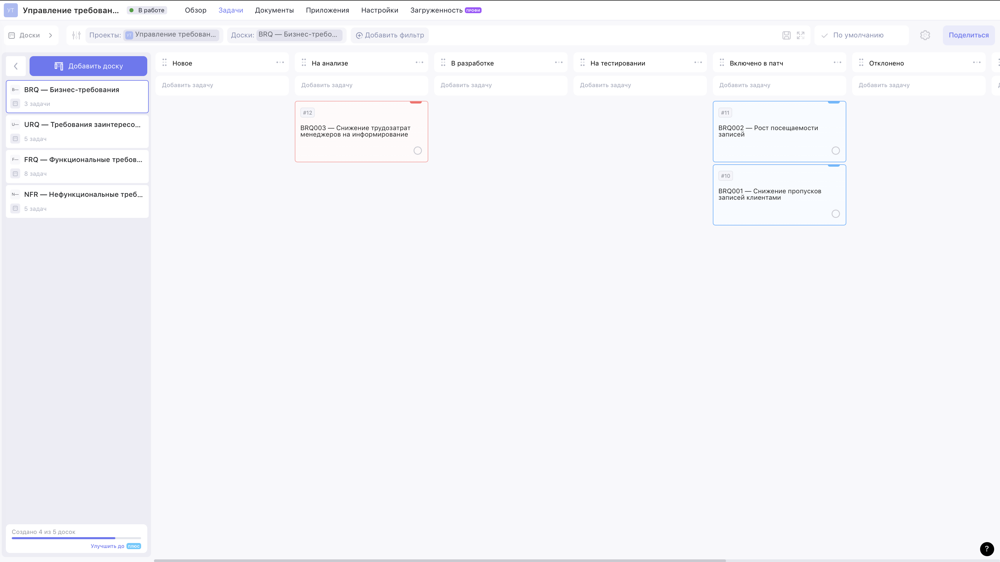
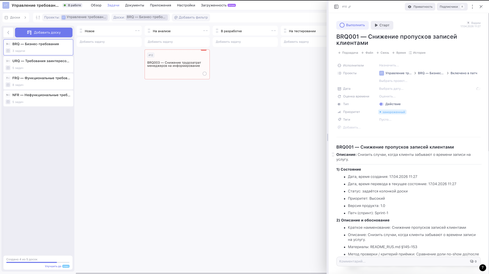
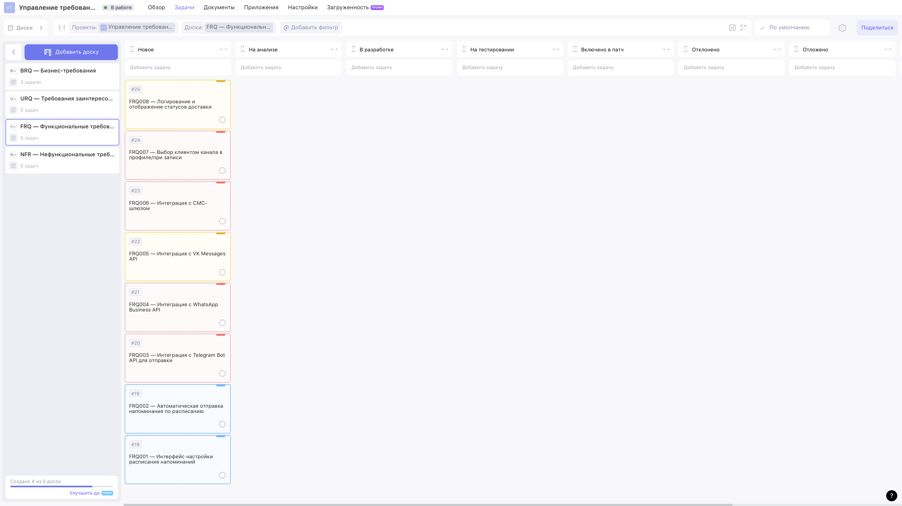
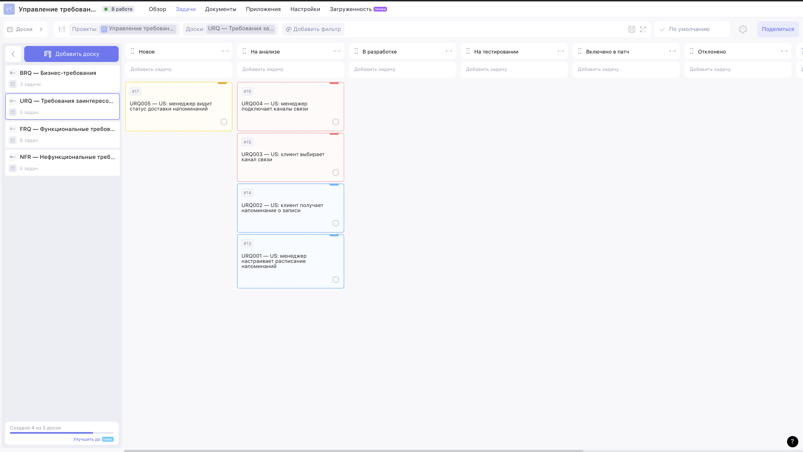
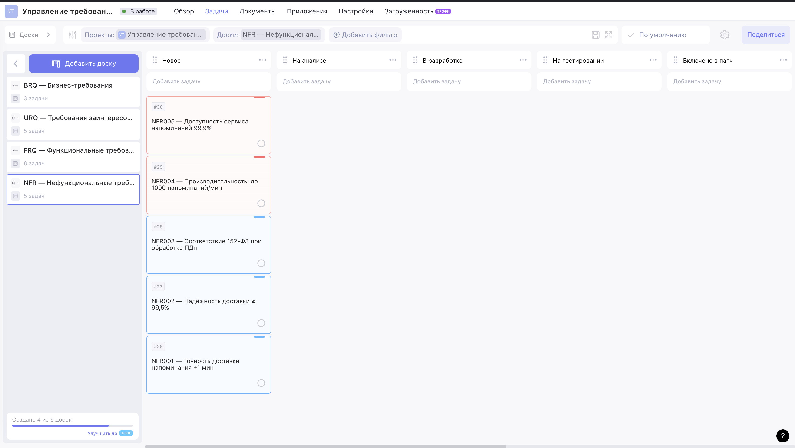

# Exercise 00 — Выделение типов требований

**Проект:** BSA13 Requirements Management · Задача 1 «Запись на стрижку»
**Инструмент:** Weeek (https://weeek.net/ru)
**Workspace / проект:** `Управление требованиями — Барбершоп` (projectId = 2)

**Публичные read-only ссылки на 4 доски упражнения** (полный индекс с
описанием — [`WEEEK_PUBLIC_LINKS.md`](./WEEEK_PUBLIC_LINKS.md)):

- BRQ (board #4) — <https://app.weeek.net/ws/942285/shared/board/oOFYJGGg83jbLYXm37rfIHj45g8PUKn9>
- URQ (board #5) — <https://app.weeek.net/ws/942285/shared/board/E2iBZHKbkVsri757d0TIGOwRmBOm8GZO>
- FRQ (board #6) — <https://app.weeek.net/ws/942285/shared/board/aX3xTM1FZi2mOPsFYUJVZcdmyZ0pbgop>
- NFR (board #7) — <https://app.weeek.net/ws/942285/shared/board/jApIbcvIN0Stm1w1wRj5H9GMrdrnbj3X>

Каждая ссылка открывается без регистрации в Weeek и даёт
read-only-доступ к доске и всем её карточкам (включая описание с
атрибутами и нативными полями).

Визуальные доказательства: см. скриншоты в папке [`src/image/`](./image/).
Сводная таблица кадров — в разделе [«Галерея скриншотов»](#6-галерея-скриншотов) в конце отчёта.

---

## 1. Типы требований (4 шт., трёхбуквенные идентификаторы)

| Код   | Тип                                      | Доска Weeek | Содержимое                                               |
| ----- | ---------------------------------------- | :---------: | -------------------------------------------------------- |
| `BRQ` | Бизнес-требования                        |    #4       | Цели, задачи продукта, бизнес-правила                    |
| `URQ` | Требования заинтересованных сторон       |    #5       | UC, US, бизнес-процессы, схемы БД                        |
| `FRQ` | Функциональные требования к системе      |    #6       | Спецификации функций, интерфейсы                         |
| `NFR` | Нефункциональные требования              |    #7       | Атрибуты качества (производительность, надёжность, ПДн)  |

Формат полного идентификатора: `<КОД>NNN` (пример: `BRQ001`, `NFR005`).

В левом сайдбаре Weeek видны все 4 доски одного проекта — это и есть
4 типа требований с трёхбуквенными идентификаторами:

---

## 2. Атрибуты требований

Сохраняются в структурированном описании карточки Weeek (HTML-разделы) +
используются нативные поля Weeek.

| Группа             | Атрибут                                      | Где хранится                                 |
| ------------------ | -------------------------------------------- | -------------------------------------------- |
| Состояние          | Дата/время создания                          | описание (и нативное `createdAt` в Weeek)    |
| Состояние          | Дата/время перевода в текущее состояние      | описание                                     |
| Состояние          | Статус                                       | колонка доски (`boardColumnId`)              |
| Состояние          | Приоритет                                    | нативное поле `priority` (1/2/3)             |
| Состояние          | Версия продукта                              | описание (`1.0`)                             |
| Состояние          | Патч / спринт                                | описание (`Sprint-1`)                        |
| Описание / обоснов.| Краткое наименование (≤ 50 симв.)            | `title` задачи                               |
| Описание / обоснов.| Описание (≤ 150 симв.)                       | описание                                     |
| Описание / обоснов.| Размещение материалов (ссылка)               | описание                                     |
| Описание / обоснов.| Метод проверки / критерий приёмки            | описание                                     |
| Описание / обоснов.| Источник / вышестоящее требование            | описание                                     |
| Описание / обоснов.| Связи требования                             | описание                                     |
| Ответственные      | Текущий исполнитель                          | описание (+ `assignees` в Weeek)             |
| Ответственные      | Лицо, принимающее решение                    | описание                                     |
| Ответственные      | Автор                                        | описание (+ `authorId` в Weeek)              |

Открытая карточка `BRQ001` демонстрирует все три группы атрибутов
в одном месте — нативные поля Weeek сверху (проект → доска → статус,
приоритет, тип) и структурированное описание ниже (Состояние / Описание
и обоснование / Ответственные лица):

---

## 3. Статусы (все восемь — см. Exercise 00, пункт 3)

На каждой доске это колонки в таком порядке:

1. Новое
2. На анализе
3. В разработке
4. На тестировании
5. Включено в патч
6. Отклонено
7. Отложено
8. Завершено

На доске **FRQ** все восемь колонок статусов попадают в один кадр —
значит, описанный в **Exercise 00, пункт 3** жизненный цикл здесь есть целиком.

---

## 4. Развёртывание персонального экземпляра

Создан персональный workspace в https://weeek.net (владелец
`macadamm`), в нём — проект
**«Управление требованиями — Барбершоп»** с 4 досками и 32 статус-колонками
(по 8 на доску). 

---

## 5. Зарегистрированные требования (21 шт.)

Все акцентированы на выделенном курсивом фрагменте задачи 1
(автоматическая отправка напоминаний клиентам по выбранному каналу).

### BRQ — Бизнес-требования

| ID       | Краткое наименование                                | Приоритет | Статус             |
| -------- | --------------------------------------------------- | :-------: | ------------------ |
| BRQ001   | Снижение пропусков записей клиентами                |  Высокий  | Включено в патч    |
| BRQ002   | Рост посещаемости записей                           |  Высокий  | Включено в патч    |
| BRQ003   | Снижение трудозатрат менеджеров на информирование   |  Средний  | На анализе         |

`BRQ001` и `BRQ002` (высокий приоритет) уже прошли анализ и стоят
в колонке «Включено в патч» — это демонстрирует работающий жизненный
цикл, а не «всё в Новом». `BRQ003` — на стадии анализа:

### URQ — Требования заинтересованных сторон (User Stories)

| ID       | Краткое наименование                                | Приоритет | Статус     |
| -------- | --------------------------------------------------- | :-------: | ---------- |
| URQ001   | US: менеджер настраивает расписание напоминаний     |  Высокий  | На анализе |
| URQ002   | US: клиент получает напоминание о записи            |  Высокий  | На анализе |
| URQ003   | US: клиент выбирает канал связи                     |  Средний  | На анализе |
| URQ004   | US: менеджер подключает каналы связи                |  Средний  | На анализе |
| URQ005   | US: менеджер видит статус доставки напоминаний      |  Низкий   | Новое      |

User Stories двух ролей — менеджер и клиент — прослеживаются от BRQ
вниз к функциям (см. ссылки в описании каждой карточки):

### FRQ — Функциональные требования

| ID       | Краткое наименование                                | Приоритет | Статус |
| -------- | --------------------------------------------------- | :-------: | ------ |
| FRQ001   | Интерфейс настройки расписания напоминаний          |  Высокий  | Новое  |
| FRQ002   | Автоматическая отправка напоминания по расписанию   |  Высокий  | Новое  |
| FRQ003   | Интеграция с Telegram Bot API                       |  Средний  | Новое  |
| FRQ004   | Интеграция с WhatsApp Business API                  |  Средний  | Новое  |
| FRQ005   | Интеграция с VK Messages API                        |  Низкий   | Новое  |
| FRQ006   | Интеграция с СМС-шлюзом                             |  Средний  | Новое  |
| FRQ007   | Выбор клиентом канала в профиле / при записи        |  Средний  | Новое  |
| FRQ008   | Логирование и отображение статусов доставки         |  Низкий   | Новое  |

Доска FRQ — самая плотная: 8 функциональных спецификаций и сразу все
8 колонок-статусов в кадре (общий обзор структуры):

### NFR — Нефункциональные требования

| ID       | Краткое наименование                          | Приоритет | Статус |
| -------- | --------------------------------------------- | :-------: | ------ |
| NFR001   | Точность доставки напоминания ±1 мин          |  Высокий  | Новое  |
| NFR002   | Надёжность доставки ≥ 99,5%                   |  Высокий  | Новое  |
| NFR003   | Соответствие 152-ФЗ при обработке ПДн         |  Высокий  | Новое  |
| NFR004   | Производительность: до 1000 напоминаний/мин   |  Средний  | Новое  |
| NFR005   | Доступность сервиса напоминаний 99,9%         |  Средний  | Новое  |

Атрибуты качества: производительность, надёжность, доступность и
соответствие 152-ФЗ (обработка ПДн):

---

## 6. Галерея скриншотов

| #  | Файл                                                                 | Что доказывает                                                       |
| -- | -------------------------------------------------------------------- | -------------------------------------------------------------------- |
| 1  | [`ex00-1-brq.png`](./image/ex00-1-brq.png)                           | Доска **BRQ** с 3 бизнес-требованиями; сайдбар с 4 досками (4 типа). |
| 2  | [`ex00-2-urq.png`](./image/ex00-2-urq.png)                           | Доска **URQ** с 5 User Stories (менеджер + клиент).                  |
| 3  | [`ex00-3-frq.png`](./image/ex00-3-frq.png)                           | Доска **FRQ** с 8 функциональными требованиями и всеми 8 статусами.  |
| 4  | [`ex00-4-nfr.png`](./image/ex00-4-nfr.png)                           | Доска **NFR** с 5 требованиями качества.                             |
| 5  | [`ex00-5-card-attributes.png`](./image/ex00-5-card-attributes.png)   | Открытая карточка `BRQ001` — все атрибуты (Состояние / Описание и обоснование / Ответственные лица) + нативные поля Weeek. |

