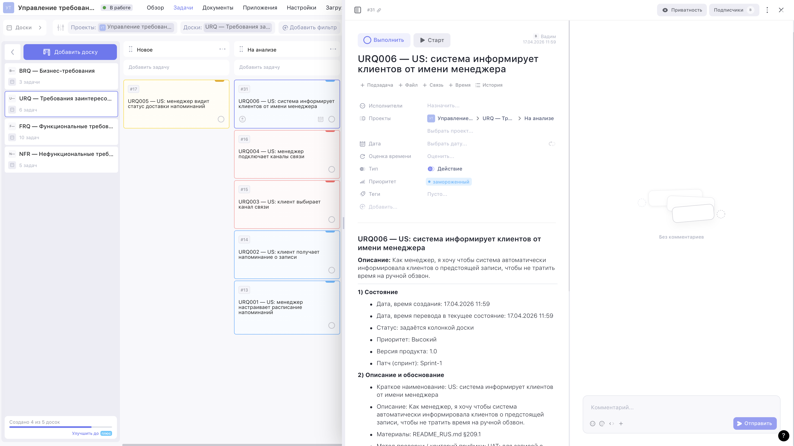
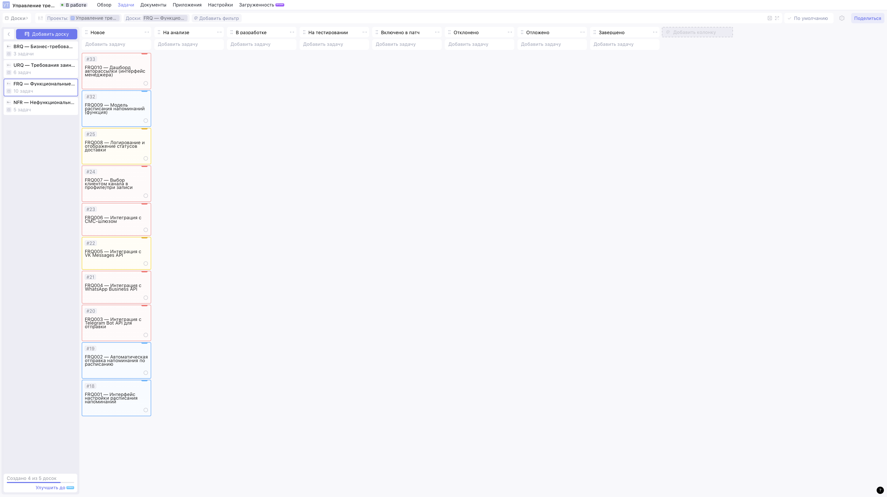

# Exercise 01 — Создание требований и регистрация

**Проект:** BSA13 Requirements Management · Задача 1 «Запись на стрижку»
**Фокус:** фрагмент условия **Задачи 1** (выделенный курсивом в тексте проекта):
*«Система должна обеспечивать автоматическую отправку напоминаний клиентам
через выбранный клиентом канал связи (Telegram, WhatsApp, VK, СМС) по
настроенному менеджером расписанию.»*

Упражнение опирается на типы, статусы и атрибуты, заведённые в Ex00
(см. [`EX00_report.md`](./EX00_report.md)) и покрывает семь пунктов
задания **Exercise 01** (пункты 1–7): три новых требования плюс связи с уже существующими.


**Публичные read-only ссылки на доски упражнения** (полный индекс с
описанием всех 5 досок — [`WEEEK_PUBLIC_LINKS.md`](./WEEEK_PUBLIC_LINKS.md)):

- URQ (board #5, карточка `URQ006`) — <https://app.weeek.net/ws/942285/shared/board/E2iBZHKbkVsri757d0TIGOwRmBOm8GZO>
- FRQ (board #6, карточки `FRQ009` / `FRQ010`) — <https://app.weeek.net/ws/942285/shared/board/aX3xTM1FZi2mOPsFYUJVZcdmyZ0pbgop>

Ревьюер открывает ссылку без логина и видит три новые карточки,
добавленные скриптом; поля в описании и нативный приоритет проверяются
кликом по карточке.

Визуальные доказательства: см. [раздел 7 «Скан / галерея скриншотов»](#7-скан--галерея-скриншотов-223) или папку [`src/image/`](./image/).

---

## 1. Декомпозиция Exercise 01, пункт 1 на User Stories (требования заинтересованных лиц)

| П. | Суть декомпозиции                         | US-требование        | Роль     | Приоритет |
| --- | ----------------------------------------- | -------------------- | -------- | :-------: |
| 1.1 | Информирование менеджером клиентов        | **URQ006** *(new)*   | менеджер | Высокий   |
| 1.2 | Получение клиентом информирования         | URQ002               | клиент   | Высокий   |
| 1.3 | Взаимодействия по каналам информирования  | URQ003 + URQ004      | клиент / менеджер | Средний |
| 1.4 | Настройка расписания информирования       | URQ001               | менеджер | Высокий   |

**URQ006 (новый):** *Как менеджер, я хочу чтобы система автоматически
информировала клиентов о предстоящей записи, чтобы не тратить время на
ручной обзвон.*

В колонке «На анализе» доски **URQ** видна новая карточка `URQ006`
рядом с существующими `URQ001/002/003/004`; открытая справа панель
показывает её атрибуты целиком (Состояние, Описание и обоснование,
Ответственные — всё, что требуется Ex00):



---

## 2. Требования к функциям системы (Exercise 01, пункт 2)

| П. | Функция                               | FRQ-требование       | Приоритет |
| --- | ------------------------------------- | -------------------- | :-------: |
| 2.1 | Настройка расписания (backend/модель) | **FRQ009** *(new)*   | Высокий   |
| 2.2 | Автоматическая отправка напоминаний   | FRQ002               | Высокий   |

**FRQ009 (новый):** модель данных и движок применения правил расписания
(offset в минутах/часах до визита, шаблон сообщения, канал). Планировщик
берёт правила из этой модели и ставит напоминания в очередь — она же
гарантирует точность `±1 мин` из `NFR001`.

---

## 3. Требования к интерфейсам системы (Exercise 01, пункт 3)

| П. | Интерфейс                            | FRQ-требование       | Приоритет |
| --- | ------------------------------------ | -------------------- | :-------: |
| 3.1 | Настройка расписания (UI менеджера)  | FRQ001               | Высокий   |
| 3.2 | Автоматическая отправка (UI-монитор) | **FRQ010** *(new)*   | Средний   |

**FRQ010 (новый):** дашборд менеджера — очередь запланированных и
отправленных напоминаний, фильтры (дата/канал/статус), действие
«Переотправить» для записей в статусе `failed`.

Доска **FRQ** после прогона Ex01 содержит 10 карточек (8 из Ex00 + 2 новых).
`FRQ009` и `FRQ010` — в колонке «Новое» (см. верхние карточки №33 и №32);
в одном кадре видны все 8 статус-колонок:



---

## 4. Приоритеты (Exercise 01, пункт 4)

Приоритет проставлен в нативном поле Weeek `priority` (1 = Низкий,
2 = Средний, 3 = Высокий). В карточках также продублирован в разделе
«Состояние» описания.

| Приоритет | Требования                                                                                                     |
| --------- | -------------------------------------------------------------------------------------------------------------- |
| Высокий   | URQ001, URQ002, URQ006, FRQ001, FRQ002, FRQ009                                                                 |
| Средний   | URQ003, URQ004, FRQ003, FRQ004, FRQ006, FRQ007, FRQ010                                                         |
| Низкий    | URQ005, FRQ005, FRQ008                                                                                         |

---

## 5. Зависимости «Источник» — вертикальные (Exercise 01, пункт 5)

Каждое URQ/FRQ-требование в поле **Источник** указывает вышестоящее
требование (для URQ это BRQ, для FRQ — URQ).

```
BRQ001  ←──┬── URQ001  ←── FRQ001, FRQ002, FRQ009
           ├── URQ002  ←── FRQ002
           ├── URQ003  ←── FRQ003..FRQ007
           └── URQ006* ←── FRQ002, FRQ010*

BRQ002  ←──── URQ002

BRQ003  ←──┬── URQ001
           ├── URQ004  ←── FRQ003..FRQ006, FRQ009*
           └── URQ006*
```

`*` — добавлено в Ex01.

---

## 6. Горизонтальные связи «Связи» (Exercise 01, пункт 6)

Горизонтальные связи проставлены в атрибуте **Связи** каждой карточки.
Сводка по новым требованиям:

| Требование | Связи                                   |
| ---------- | --------------------------------------- |
| URQ006     | URQ001, URQ002, FRQ002, FRQ010          |
| FRQ009     | FRQ001, FRQ002, NFR001                  |
| FRQ010     | FRQ002, FRQ008, NFR005                  |

Существующие связи Ex00 остаются актуальны; FRQ002 де-факто получает
новых предков (URQ006), что отражено в описании URQ006 и FRQ010.

---

## 7. Скан / галерея скриншотов (Exercise 01, пункт 7)

Оба кадра лежат в [`src/image/`](./image/).

| # | Файл                                                                     | Что доказывает                                                                                              |
| - | ------------------------------------------------------------------------ | ------------------------------------------------------------------------------------------------------------ |
| 1 | [`ex01-1-urq-urq006-card.png`](./image/ex01-1-urq-urq006-card.png)       | Доска **URQ** с 6 карточками (включая `URQ006` в «На анализе») + открытая карточка `URQ006` со всеми атрибутами (приоритет Высокий, версия 1.0, Sprint-1, «Источник», «Связи»). Соответствует Exercise 01, пункты 1, 4, 5 и 6. |
| 2 | [`ex01-2-frq-frq009-frq010.png`](./image/ex01-2-frq-frq009-frq010.png)   | Доска **FRQ** с 10 карточками: новые `FRQ009` (функция расписания, Exercise 01, пункт 2.1) и `FRQ010` (интерфейс авторассылки, Exercise 01, пункт 3.2) в колонке «Новое»; в кадре видны все 8 статус-колонок.   |

Сопоставление с пунктами задания:

- **Exercise 01, пункт 1 (User Stories):** кадр №1 — `URQ006`; остальные US (`URQ001/002/003/004`) уже в Ex00 ([`ex00-2-urq.png`](./image/ex00-2-urq.png)).
- **Exercise 01, пункт 2 (функции):** кадр №2 — `FRQ009` (2.1); `FRQ002` для 2.2 — в Ex00 ([`ex00-3-frq.png`](./image/ex00-3-frq.png)).
- **Exercise 01, пункт 3 (интерфейсы):** кадр №2 — `FRQ010` (3.2); `FRQ001` для 3.1 — в Ex00.
- **Exercise 01, пункты 4–6 (приоритеты, источник, связи):** видно на открытой карточке кадра №1 («Состояние», «Описание и обоснование», блоки «Источник» и «Связи»).

