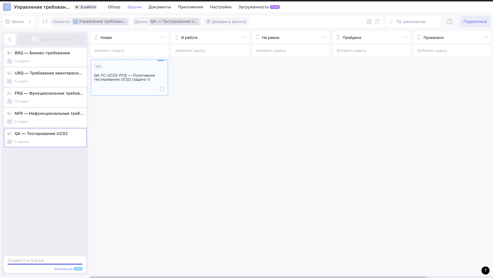
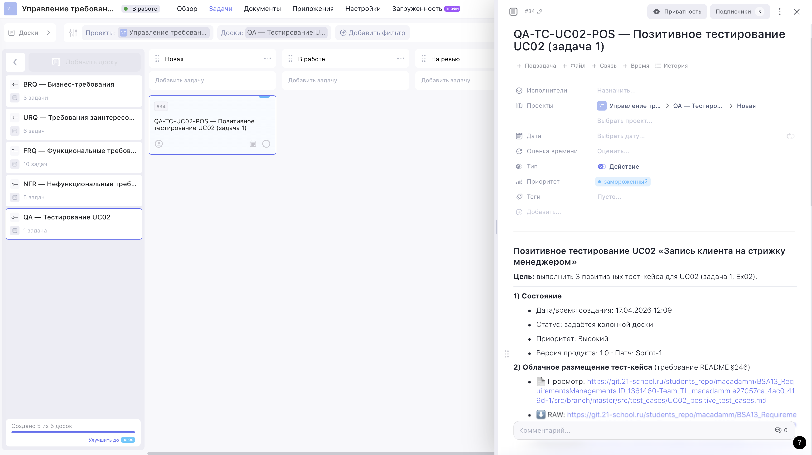

# Exercise 02 — Создание позитивного тест-кейса

**Проект:** BSA13 Requirements Management · Задача 1 «Запись на стрижку»
**Фокус:** **Exercise 02** (пункты 1–13) — позитивные тест-кейсы для **UC02**
и зарегистрировать задачу на тестирование в Weeek со ссылкой на облачное
размещение тест-кейсов.

Упражнение опирается на типы, статусы, атрибуты и требования, заведённые
в Ex00 и Ex01 (см. [`EX00_report.md`](./EX00_report.md), [`EX01_report.md`](./EX01_report.md)).


Визуальные доказательства: см. [раздел 7 «Скан / галерея скриншотов»](#7-скан--галерея-скриншотов) или папку [`src/image/`](./image/).

---

## 1. Итог одной строкой

- Тест-кейсы (3 шт., табличный вид): [`src/test_cases/UC02_positive_test_cases.md`](./test_cases/UC02_positive_test_cases.md).
- Облачное размещение (Exercise 02, пункт 12): Gitea Школы 21, ветка `develop`.
- Weeek-задача на тестирование (Exercise 02, пункт 13): доска **«QA — Тестирование UC02»** (board #8), таск `QA-TC-UC02-POS` (task #34), колонка «Новая».


---

## 2. Что такое UC02 в нашем контексте

Текст задания прямо не перечисляет номера UC, но в **Exercise 04, пункты 1–2** фигурируют
шаги «выбранный слот забронирован клиентом» и «система закрепляет слот за
мастером» — это шаги **сценария бронирования**. Упражнение 02 (Exercise 02, пункт 5)
прямо требует в качестве актора взять **менеджера** («лицо из сущности
«Сотрудник», имеющее роль менеджера»). Отсюда:

> **UC02 = «Запись клиента на стрижку менеджером»** — менеджер от имени
> клиента подбирает услугу, мастера и свободный слот, фиксирует запись
> в системе и ставит напоминания.

Полный сценарий (main flow, постусловия, менеджер-персона) описан в
[`src/test_cases/UC02_positive_test_cases.md`, раздел 1](./test_cases/UC02_positive_test_cases.md#1-контекст-uc02).

---

## 3. Сводка кейсов (Exercise 02, пункты 1–11)

| Поля кейса | ID              | Краткое название                                         | Приоритет | Покрывает требования              |
| --- | --------------- | -------------------------------------------------------- | :-------: | --------------------------------- |
| **Exercise 02**, пункты 1–9 | `TC-UC02-P-01`  | Запись зарегистрированного клиента на свободный слот     | Высокий   | FRQ001, FRQ002, URQ002, URQ003    |
| **Exercise 02**, пункты 1–9 | `TC-UC02-P-02`  | Создание клиента «на лету» и запись на свободный слот    | Средний   | FRQ001, URQ003, NFR003 (152-ФЗ)   |
| **Exercise 02**, пункты 1–9 | `TC-UC02-P-03`  | Запись на ближайший свободный слот (граничное условие)   | Средний   | FRQ009, NFR001                    |

Каждый кейс содержит все 9 обязательных полей (Exercise 02, пункты 1–9) плюс отметки
о **Повторяемости** (F.I.Repeatable.S.T., Exercise 02, пункт 10) и **Атомарности**
(F.Independent.S.T., Exercise 02, пункт 11).

---

## 4. Как покрыты пункты задания

| Пункт Exercise 02 | Требование                                                                                          | Где выполнено                                                                                                     |
| :------: | --------------------------------------------------------------------------------------------------- | ----------------------------------------------------------------------------------------------------------------- |
|  1     | Буквенно-цифровой идентификатор                                                                     | `TC-UC02-P-01 / -02 / -03` — строка «1. ID» в каждом кейсе                                                        |
|  2     | Краткое название теста                                                                              | Строка «2. Название» в каждом кейсе                                                                               |
|  3     | Приоритет                                                                                           | Строка «3. Приоритет» + сводная таблица выше                                                                      |
|  4     | Предусловие                                                                                         | Строка «4. Предусловие» — с конкретными клиентами, мастерами, слотами                                             |
|  5     | Выбор менеджера (сотрудник с ролью менеджера)                                                       | Менеджер-персона `EMP-003` · Сидорова М.П. · role = manager (см. [п. 1.3 файла с кейсами](./test_cases/UC02_positive_test_cases.md#менеджер-персона-для-всех-кейсов)) |
|  6     | Шаги выполнения (однозначно, с корректными значениями)                                              | Строка «6. Шаги» — 6–7 пронумерованных действий с конкретными значениями полей                                    |
|  7     | Ожидаемый результат (ОР)                                                                            | Строка «7. ОР» — с конкретными проверяемыми пунктами (a/b/c/d)                                                    |
|  8     | Постусловия (восстановление состояния)                                                              | Строка «8. Постусловие» — явный DELETE/rollback                                                                   |
|  9     | Фактический результат (ФР)                                                                          | Строка «9. ФР» — placeholder `Pending`, заполняется при фактическом прогоне                                       |
|  10     | Повторяемость (F.I.Repeatable.S.T.)                                                                 | Строка «10. Повторяемость» с обоснованием                                                                         |
|  11     | Атомарность/Независимость (F.Independent.S.T.)                                                      | Строка «11. Атомарность» с обоснованием (разные мастера / слоты / клиенты)                                        |
|  12     | Табличный вид + облачное хранилище                                                                  | Markdown-таблицы в файле, размещённом в Gitea Школы 21 (см. раздел 5 ниже)                                              |
|  13     | Weeek-задача со ссылкой на тест-кейс                                                                | Task #34 `QA-TC-UC02-POS` на доске #8 «QA — Тестирование UC02» (см. раздел 6 ниже)                                           |

---

## 5. Облачное размещение (Exercise 02, пункт 12)

Репозиторий курса хостится на **Gitea Школы 21**. После `git push`
ссылки становятся рабочими для ревьюера:

- **Просмотр (веб-UI):**
  `https://git.21-school.ru/students_repo/macadamm/BSA13_RequirementsManagements.ID_1361460-Team_TL_macadamm.3fff47d4_122e_4d5c-2/src/branch/develop/src/test_cases/UC02_positive_test_cases.md`
- **Raw-версия (прямая выгрузка текста):**
  `https://git.21-school.ru/students_repo/macadamm/BSA13_RequirementsManagements.ID_1361460-Team_TL_macadamm.3fff47d4_122e_4d5c-2/raw/branch/develop/src/test_cases/UC02_positive_test_cases.md`

Обе ссылки также встроены в описание Weeek-задачи (п. 6).

---

## 6. Задача в Weeek (Exercise 02, пункт 13)


```
Проект #2. Обеспечиваю доску «QA — Тестирование UC02»…
  • создана доска #8 «QA — Тестирование UC02»
    статусы: Новая, В работе, На ревью, Пройдено, Провалено

Создаю QA-задачу в колонке «Новая»…

Готово.
  Доска: #8 «QA — Тестирование UC02»
  Задача: #34 («Новая»)
```

**Содержимое задачи (кратко):**

- Заголовок: `QA-TC-UC02-POS — Позитивное тестирование UC02 (задача 1)`.
- Приоритет: Высокий (native-поле Weeek).
- Описание: цель, обе ссылки на тест-кейс (view + raw), список из трёх
  TC, критерии приёмки, ответственные лица, менеджер-персона (`EMP-003`).

**Доска с задачей** — слева в панели проекта видны все 5 досок, созданных
за Ex00–Ex02 (BRQ / URQ / FRQ / NFR / QA), новая доска «QA — Тестирование
UC02» содержит одну карточку `#34` в колонке «Новая»:



**Открытая карточка `#34`** — в описании виден заголовок, блок «Состояние»
(дата, статус, приоритет, версия/патч) и блок «Облачное размещение
тест-кейса» с двумя ссылками (view и RAW) на файл
`UC02_positive_test_cases.md` в Gitea Школы 21:



---

## 7. Скан / галерея скриншотов

Оба кадра лежат в [`src/image/`](./image/).

| # | Файл                                                                 | Что доказывает                                                                                                                                              |
| - | -------------------------------------------------------------------- | ------------------------------------------------------------------------------------------------------------------------------------------------------------ |
| 1 | [`ex02-1-qa-board.png`](./image/ex02-1-qa-board.png)                 | Новая QA-доска «QA — Тестирование UC02» с 5 колонками `Новая / В работе / На ревью / Пройдено / Провалено` и карточкой `#34`. Подтверждает Exercise 02, пункт 13 (задача на тестирование заведена). |
| 2 | [`ex02-2-qa-card.png`](./image/ex02-2-qa-card.png)                   | Открытая карточка `QA-TC-UC02-POS (#34)`: заголовок, состояние (Высокий, 1.0, Sprint-1), блок «Облачное размещение тест-кейса» с двумя ссылками на git. Подтверждает Exercise 02, пункты 12 и 13 (облачное хранилище и ссылка на тест-кейс). |

Сопоставление с пунктами задания:

- **Exercise 02, пункты 1–11** (поля каждого кейса): см. [`UC02_positive_test_cases.md`](./test_cases/UC02_positive_test_cases.md); ревьюеру — по ссылкам из кадра №2.
- **Exercise 02, пункт 12** (табличный вид и облачное хранилище): таблицы в том же файле, raw/view — на скрине №2.
- **Exercise 02, пункт 13** (задача в Weeek со ссылкой на кейсы): кадры №1 и №2.

