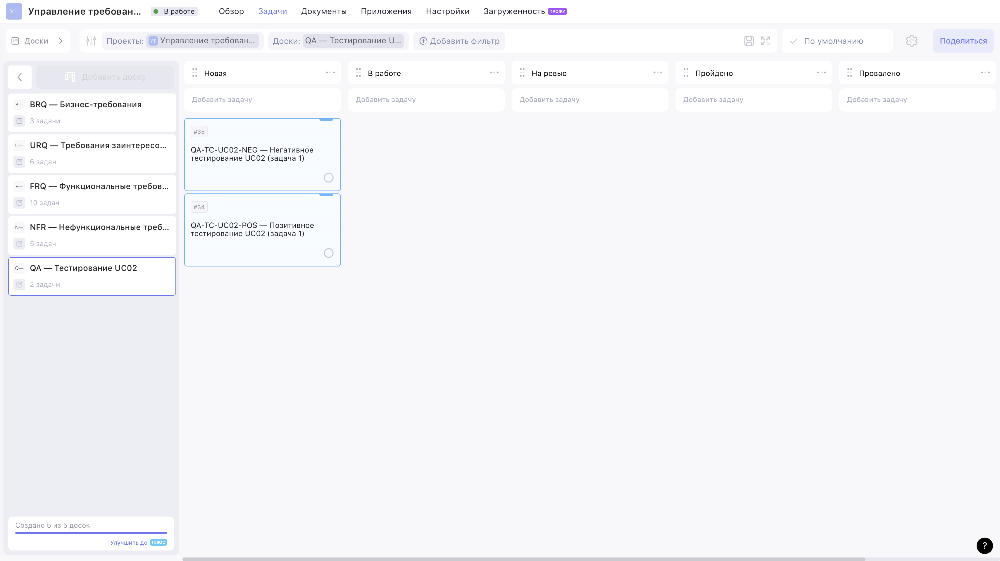
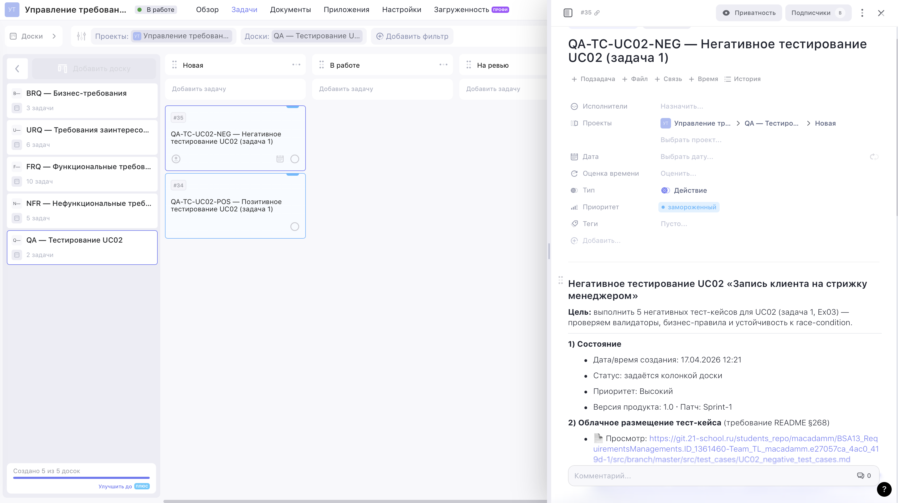

# Exercise 03 — Создание негативного тест-кейса

**Проект:** BSA13 Requirements Management · Задача 1 «Запись на стрижку»
**Фокус:** **Exercise 03** (пункты 1–13) — **негативные** тест-кейсы для **UC02**
и регистрация задачи на тестирование в Weeek со ссылкой на облачное
размещение тест-кейсов.

Упражнение опирается на определение UC02 и менеджера-персоны из Ex02
(см. [`EX02_report.md`](./EX02_report.md),
[раздел 1 в `UC02_positive_test_cases.md`](./test_cases/UC02_positive_test_cases.md#1-контекст-uc02)),
а также на типы/статусы/требования из Ex00–Ex01.

**Публичная read-only ссылка на QA-доску** (туда скрипт добавляет
Weeek-задачу `QA-TC-UC02-NEG`, как требует **Exercise 03, пункт 13**): <https://app.weeek.net/ws/942285/shared/board/rDflJOBjP16xEHlFBk1Etc6jphk4LS3q>.
Ревьюер открывает её без логина и видит карточку `#35` в колонке
«Новая» рядом с `#34` (Ex02) — обе с полными view/raw-ссылками на
Gitea в описании. Полный индекс 5 публичных досок проекта —
[`WEEEK_PUBLIC_LINKS.md`](./WEEEK_PUBLIC_LINKS.md).

Визуальные доказательства: см. [раздел 8 «Скан / галерея скриншотов»](#8-скан--галерея-скриншотов) или папку [`src/image/`](./image/).

---

## 1. Итог одной строкой

- Тест-кейсы (5 шт., табличный вид): [`src/test_cases/UC02_negative_test_cases.md`](./test_cases/UC02_negative_test_cases.md).
- Облачное размещение (Exercise 03, пункт 12): репозиторий Школы 21 на git.21-school.ru, ветка `develop`.
- Weeek-задача (Exercise 03, пункт 13): доска **«QA — Тестирование UC02»** (board #8), таск `QA-TC-UC02-NEG` (task #35), колонка «Новая».

---

## 2. Стратегия негативного покрытия

Негативные кейсы выбраны так, чтобы проверить **5 разных категорий**
сбоев UC02, а не пять вариантов одной и той же ошибки:

| Категория                    | Проверяем                                                                        | Кейс            | Приоритет |
| ---------------------------- | -------------------------------------------------------------------------------- | --------------- | :-------: |
| Race / concurrency           | Слот был занят после открытия формы, но до сохранения                            | `TC-UC02-N-01`  | Высокий   |
| Клиентская валидация формы   | Обязательное поле «Канал связи» оставлено пустым                                 | `TC-UC02-N-02`  | Высокий   |
| Валидация формата данных     | Невалидный телефон при создании клиента «на лету»                                | `TC-UC02-N-03`  | Средний   |
| Нарушение бизнес-правила     | Мастер не оказывает выбранную услугу                                             | `TC-UC02-N-04`  | Средний   |
| Граница времени              | Выбранный слот уже наступил / прошёл                                             | `TC-UC02-N-05`  | Низкий    |

Каждый кейс соответствует принципам **F.I.Repeatable.S.T.** (Exercise 03, пункт 10) —
состояние БД и расписания возвращается к исходному — и
**F.Independent.S.T.** (Exercise 03, пункт 11) — свой слот/мастер/клиент, порядок прогона
не важен.

---

## 3. Как покрыты пункты задания

| Пункт Exercise 03 | Требование                                                                           | Где выполнено                                                                                                               |
| :------: | ------------------------------------------------------------------------------------ | --------------------------------------------------------------------------------------------------------------------------- |
|  1     | Буквенно-цифровой идентификатор                                                      | `TC-UC02-N-01…05` — строка «1. ID» в каждом кейсе                                                                           |
|  2     | Краткое название теста                                                                | Строка «2. Название» в каждом кейсе                                                                                         |
|  3     | Приоритет                                                                             | Строка «3. Приоритет» + сводные таблицы                                                                                     |
|  4     | Предусловие                                                                           | Строка «4. Предусловие» с конкретными клиентами, мастерами, слотами                                                         |
|  5     | Менеджер (роль manager)                                                               | `EMP-003` · Сидорова М. П. — одна и та же персона для всех кейсов (см. `UC02_positive_test_cases.md`, раздел 1.3)                   |
|  6     | Шаги выполнения                                                                       | Строка «6. Шаги» — 6–9 пронумерованных действий с конкретными значениями полей                                              |
|  7     | Ожидаемый результат (ОР)                                                              | Строка «7. ОР» — с конкретными кодами ответов, тел сообщений, SQL-проверкой                                                 |
|  8     | Постусловия                                                                           | Строка «8. Постусловие» — явный откат / подтверждение неизменности БД                                                       |
|  9     | Фактический результат (ФР)                                                            | Строка «9. ФР» — `Pending`, заполняется при фактическом прогоне                                                             |
|  10     | Повторяемость                                                                         | Строка «10. Повторяемость» с обоснованием                                                                                   |
|  11     | Атомарность / Независимость                                                           | Строка «11. Атомарность» — у каждого кейса уникальная связка мастер+слот                                                    |
|  12     | Табличный вид + облачное хранилище                                                    | Markdown-таблицы в файле, размещённом в Gitea Школы 21                                                                      |
|  13     | Weeek-задача со ссылкой на тест-кейс                                                  | Task #35 `QA-TC-UC02-NEG` на доске #8 «QA — Тестирование UC02»                                                              |

---

## 4. Облачное размещение (Exercise 03, пункт 12)

- **Просмотр:**
  `https://git.21-school.ru/students_repo/macadamm/BSA13_RequirementsManagements.ID_1361460-Team_TL_macadamm.3fff47d4_122e_4d5c-2/src/branch/develop/src/test_cases/UC02_negative_test_cases.md`
- **Raw:**
  `https://git.21-school.ru/students_repo/macadamm/BSA13_RequirementsManagements.ID_1361460-Team_TL_macadamm.3fff47d4_122e_4d5c-2/raw/branch/develop/src/test_cases/UC02_negative_test_cases.md`

Обе ссылки встроены в описание Weeek-задачи (раздел 5 этого отчёта).

---

## 5. Задача в Weeek (Exercise 03, пункт 13)

Используется та же QA-доска, что и в Ex02 (чтобы позитивный и негативный
прогоны жили рядом). 

```
Проект #2. Ищу доску «QA — Тестирование UC02»…
  • доска #8, колонок 5

Создаю QA-задачу в колонке «Новая»…

Готово.
  Доска: #8 «QA — Тестирование UC02»
  Задача: #35 («Новая»)
```

**Содержимое задачи (кратко):**

- Заголовок: `QA-TC-UC02-NEG — Негативное тестирование UC02 (задача 1)`.
- Приоритет: Высокий (native-поле Weeek).
- Описание: цель, обе git-ссылки (view + raw), список из 5 TC с
  приоритетами, критерии приёмки, ответственные лица, ссылка на парный
  таск `QA-TC-UC02-POS`.

После прогона Ex02 + Ex03 доска **QA — Тестирование UC02** содержит
**2 задачи** в колонке «Новая»:

| # | task | Что тестируем                       |
| - | ---- | ----------------------------------- |
| 1 | #34  | `QA-TC-UC02-POS` — позитив (Ex02)   |
| 2 | #35  | `QA-TC-UC02-NEG` — негатив (Ex03)   |

**Доска** — в одном кадре виден весь QA-контур UC02: обе карточки лежат
рядом в колонке «Новая», что явно показывает пару POS/NEG и факт
регистрации задачи Ex03 (Exercise 03, пункт 13):



**Открытая карточка #35** — в описании виден заголовок, блок «Состояние»
(Высокий, 1.0, Sprint-1) и блок «Облачное размещение тест-кейса» со
ссылкой на `UC02_negative_test_cases.md` в Gitea Школы 21 (Exercise 03, пункт 12 + Exercise 03, пункт 13):



---

## 8. Скан / галерея скриншотов

Ниже — скриншоты под требование Exercise 03, пункт 13 (зарегистрировать задачу тестирования):
на доске Weeek видно, что условие выполнено.

### 8.1 Доска «QA — Тестирование UC02» с обеими QA-задачами

Виден проект **«Управление требованиями»**, в левом сайдбаре — доски
BRQ / URQ / FRQ / NFR и новая **QA — Тестирование UC02** (выделена). В
колонке **«Новая»** лежат обе карточки:

- `#35 QA-TC-UC02-NEG — Негативное тестирование UC02 (задача 1)` — Ex03;
- `#34 QA-TC-UC02-POS — Позитивное тестирование UC02 (задача 1)` — Ex02.


### 8.2 Карточка `QA-TC-UC02-NEG (#35)` с git-ссылкой на негативные кейсы

На второй картинке та же доска, но открыта деталь карточки `#35`. В
правой панели:

- заголовок `QA-TC-UC02-NEG — Негативное тестирование UC02 (задача 1)`,
  проект/доска/колонка привязаны к QA → Новая;
- блок **«Состояние»**: дата создания `17.04.2026 12:21`, версия `1.0`,
  патч `Sprint-1`, приоритет «Высокий» (Weeek рисует его как
  `замороженный` из-за локализации лейбла, само значение API = 3);
- блок **«Облачное размещение тест-кейса»** (Exercise 03, пункт 12) со ссылкой
  `https://git.21-school.ru/students_repo/macadamm/BSA13_RequirementsManagements.ID_1361460-Team_TL_macadamm.3fff47d4_122e_4d5c-2/src/branch/develop/src/test_cases/UC02_negative_test_cases.md`
  — это и есть Git-«облачное» хранилище из Ex02/Ex03 (ветка `develop`, тот же репозиторий, что в §4).


### 8.3 Сводка по Exercise 03, пункты 1–13

| Условие (Exercise 03)                                 | Ссылка на артефакт                                                                              | Визуальное доказательство |
| --------------------------------------------------- | ----------------------------------------------------------------------------------------------- | ------------------------- |
| Exercise 03, пункты 1–12 — атрибуты тест-кейса                  | [`UC02_negative_test_cases.md`](./test_cases/UC02_negative_test_cases.md)                       | п. 8.2 (ссылка в карточке)  |
| Exercise 03, пункт 12 — облачное размещение                          | Gitea Школы 21, raw-ссылка внутри описания карточки `#35`                                       | п. 8.2                      |
| Exercise 03, пункт 13 — зарегистрирована задача тестирования         | Weeek task `#35 QA-TC-UC02-NEG` в колонке «Новая» доски «QA — Тестирование UC02» (проект #5)    | п. 8.1 + п. 8.2               |
| Exercise 03, пункт 13 — ссылка из задачи ведёт на тест-кейс          | В п. 2 карточки `#35` два клика: «Просмотр» (Gitea UI) и «Raw» (сырой md)                          | п. 8.2                      |
