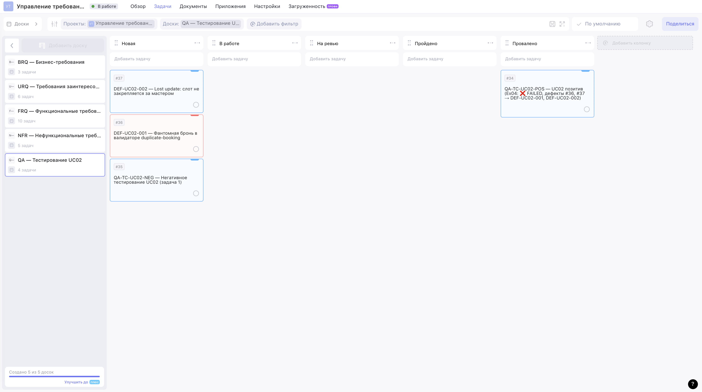
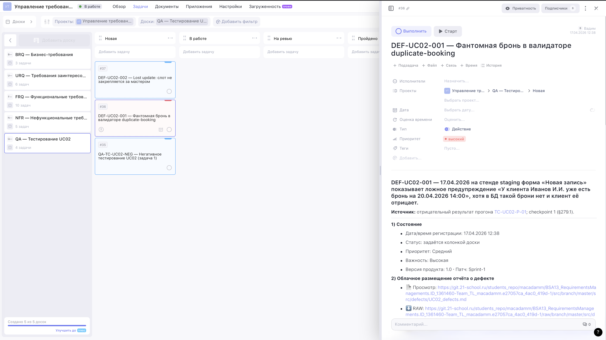
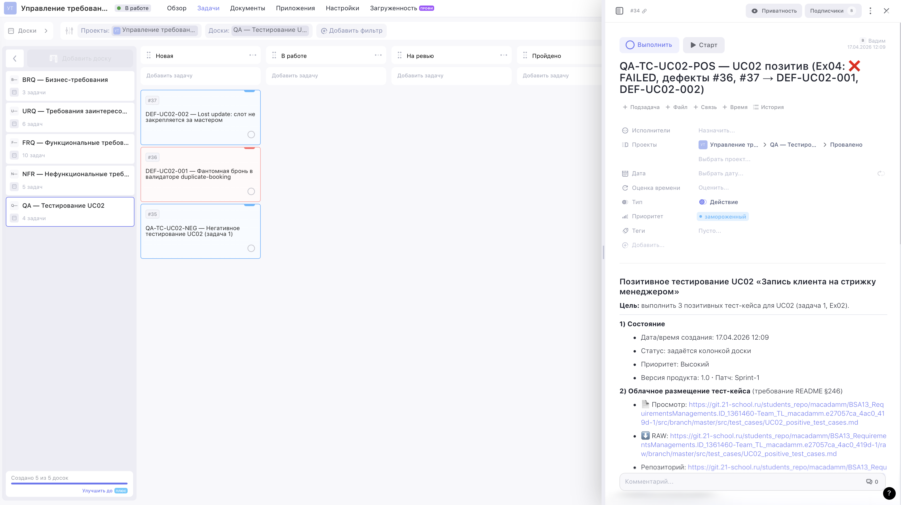

# Exercise 04 — Оценка результата (UC02, TC-UC02-P-01)

**Проект:** BSA13 Requirements Management · Задача 1 «Запись на стрижку»
**Фокус:** **Exercise 04** — оценить результат позитивного тест-кейса
`TC-UC02-P-01` для UC02; при необходимости завести отчёт о дефекте (12
атрибутов по **Exercise 04, пункт 3 подпункт 1**), обновить графу ФР (**Exercise 04, пункт 3 подпункт 2**) и зарегистрировать задачу
тестирования в Weeek.

Упражнение опирается на артефакты Ex02/Ex03:

- определение UC02 и менеджера-персоны — [раздел 1 в `UC02_positive_test_cases.md`](./test_cases/UC02_positive_test_cases.md#1-контекст-uc02);
- позитивный тест-кейс `TC-UC02-P-01` — [раздел 3 там же](./test_cases/UC02_positive_test_cases.md#tc-uc02-p-01);
- QA-доска и карточка `#34 QA-TC-UC02-POS` — [`EX02_report.md`](./EX02_report.md);
- парная NEG-карточка `#35 QA-TC-UC02-NEG` — [`EX03_report.md`](./EX03_report.md).

**Публичная read-only ссылка на QA-доску** (все артефакты этого
упражнения — `#36`, `#37`, а также перенесённый `#34` в «Провалено»):
<https://app.weeek.net/ws/942285/shared/board/rDflJOBjP16xEHlFBk1Etc6jphk4LS3q>.
Ревьюер открывает её без логина и видит все четыре карточки UC02
одновременно: `#34` в «Провалено» с пометкой `Ex04: ❌ FAILED …`, `#35`
(NEG) и `#36`/`#37` (дефекты) в «Новая» — так видно выполнение **Exercise 04, пункт 3 подпункт 2**.
Полный индекс 5 публичных досок проекта —
[`WEEEK_PUBLIC_LINKS.md`](./WEEEK_PUBLIC_LINKS.md).

---

## 1. Итог одной строкой

- **Итог прогона `TC-UC02-P-01` = ❌ FAIL** (сработали обе «bug»-ветви задания:
  **Exercise 04, пункт 1 подпункт 1** и **Exercise 04, пункт 2 подпункт 2**).
- Отчёты о дефектах (два, по одному на каждый checkpoint):
  [`src/defects/UC02_defects.md`](./defects/UC02_defects.md).
- ФР кейса обновлён в [`UC02_positive_test_cases.md`](./test_cases/UC02_positive_test_cases.md#tc-uc02-p-01)
  (раздел 3; Exercise 04, пункт 3 подпункт 2) — добавлены ссылки на `DEF-UC02-001` и `DEF-UC02-002`.
- Weeek:
  - задачи-дефекты заведены на доске **«QA — Тестирование UC02»**
    (board #8) в колонке **«Новая»**: task **#36** = `DEF-UC02-001`,
    task **#37** = `DEF-UC02-002`;
  - QA-таск `#34 QA-TC-UC02-POS` переведён из «Новая» → **«Провалено»**,
    в заголовок дописана пометка `Ex04: ❌ FAILED, дефекты #36, #37 →
    DEF-UC02-001, DEF-UC02-002`.


---

## 2. Оценка результата (Exercise 04, пункты 1–2)

Прогон `TC-UC02-P-01` имеет **два контрольных замера** (**Exercise 04**): после шагов
«п.п.1–2» (выбор клиента/слота — **пункт 1**) и после шагов «п.п.1–5»
(нажатие «Сохранить» — **пункт 2**).

| Checkpoint | Замер выполняется после              | «OK»-ветвь (подп. 2)                                       | «Bug»-ветвь                                                         | Что наблюдали 17.04.2026                                                                                               |
| :--------: | ------------------------------------ | ------------------------------------------------------ | ------------------------------------------------------------------- | ----------------------------------------------------------------------------------------------------------------------- |
| 1          | после п.п.1–2 (Exercise 04, **пункт 1**) | подп. **2**: «слот не забронирован»   | подп. **1**: «слот забронирован клиентом», клиент отрицает | подп. **1** — жёлтый баннер «у клиента уже есть бронь», клиент по телефону отрицает (фантомная бронь из stale-кэша Redis)       |
| 2          | после п.п.1–5 (Exercise 04, **пункт 2**) | подп. **1**: «слот закрепляется и исчезает из свободных» | подп. **2**: «слот не закреплён, снова доступен для выбора»                       | подп. **2** — запись `#501` создана, но слот `20.04.2026 14:00` остаётся `free` и успешно бронируется повторно (`#502`, double-booking) |

**Итог:** обе ветви — «bug». Значит, по **Exercise 04, пункт 3** нужно **зарегистрировать отчёт о
дефекте на каждую аномалию** — см. раздел 3 ниже. По **Exercise 04, пункт 3 подпункт 2** — обновить графу
ФР тест-кейса с отметкой об отрицательном результате и ID дефектов.

> **Почему именно два дефекта, а не один?**
>
> Аномалии независимы: checkpoint 1 — проблема **чтения/кэширования**
> (stale Redis), checkpoint 2 — проблема **записи/транзакций** (lost
> update между booking-service и schedule-service). Разные компоненты,
> разные владельцы, разные приоритеты — каждая требует отдельного
> тикета, иначе тимлид не сможет корректно диспатчить работы. По тому
> же правилу **Exercise 04, пункт 3 подпункт 1, поле 1** («идентификатор дефекта») — одна аномалия = один ID.

---

## 3. Отчёты о дефектах (Exercise 04, пункт 3 подпункт 1)

Полные отчёты — в [`src/defects/UC02_defects.md`](./defects/UC02_defects.md),
в каждом заполнены все 12 атрибутов из **Exercise 04, пункт 3 подпункт 1** (поля с «\*» —
необязательные — тоже заполнены для полноты трассируемости).

| Отчёт                                                                                          | Checkpoint | Приоритет | Важность      | Тип первопричины                          | Weeek task |
| ---------------------------------------------------------------------------------------------- | :--------: | :-------: | :-----------: | ----------------------------------------- | :--------: |
| [`DEF-UC02-001`](./defects/UC02_defects.md#def-uc02-001) | 1 (Exercise 04, пункт 1 подпункт 1) | Средний   | Высокая       | stale Redis-кэш в duplicate-валидаторе    | **#36**    |
| [`DEF-UC02-002`](./defects/UC02_defects.md#def-uc02-002) | 2 (Exercise 04, пункт 2 подпункт 2) | Высокий   | Критическая   | lost update между booking / schedule (нет саги / SELECT FOR UPDATE) | **#37**    |

**Как покрыты 12 атрибутов Exercise 04, пункт 3 подпункт 1** (сводка здесь; полная таблица — в разделе 5 [`UC02_defects.md`](./defects/UC02_defects.md)):

| П. | Атрибут                                          | DEF-UC02-001 | DEF-UC02-002 |
| :---: | ------------------------------------------------ | :----------: | :----------: |
| 286.1.1  | Идентификатор (буквенно-цифровой)             | ✔ `DEF-UC02-001` | ✔ `DEF-UC02-002` |
| 286.1.2  | Краткое описание («что, где, когда?»)         | ✔            | ✔            |
| 286.1.3  | \*Предусловие                                 | ✔            | ✔            |
| 286.1.4  | Шаги воспроизведения (≠ шагов TC)             | ✔ 5 шагов    | ✔ 5 шагов    |
| 286.1.5  | Ожидаемый результат (ОР)                      | ✔            | ✔            |
| 286.1.6  | Фактический результат (подчёркнуто отличие)   | ✔            | ✔            |
| 286.1.7  | \*Постусловия (восстановление состояния)      | ✔            | ✔            |
| 286.1.8  | \*Окружение (ОС / браузер / API / БД)         | ✔            | ✔            |
| 286.1.9  | Приоритет                                     | Средний      | Высокий      |
| 286.1.10 | \*Важность                                    | Высокая      | Критическая  |
| 286.1.11 | Описание (первопричина, гипотеза исправления) | ✔            | ✔            |
| 286.1.12 | Доп. материалы (скриншоты, логи, видео)       | ✔ 5 арт.     | ✔ 5 арт.     |

---

## 4. Обновление графы ФР (Exercise 04, пункт 3 подпункт 2) и трассируемость

В **Exercise 04, пункт 3 подпункт 2** ожидают: «Укажите в графе ФР отметку об отрицательном результате
и идентификатор зарегистрированного дефекта».

В файле [`UC02_positive_test_cases.md`](./test_cases/UC02_positive_test_cases.md)
для `TC-UC02-P-01` поле «**9. Фактический результат (ФР)**»:

- имел значение `_Pending — заполнить после прогона._`;
- обновлён на развёрнутую запись с датой/стендом/коммитом, указанием
  отличий от ОР по каждому пункту (a/b/c/d) и ссылкой на оба отчёта о
  дефекте:
  - `checkpoint 1 (Exercise 04, пункт 1 подпункт 1)` → `DEF-UC02-001`;
  - `checkpoint 2 (Exercise 04, пункт 2 подпункт 2)` → `DEF-UC02-002`.

Для `TC-UC02-P-02` и `TC-UC02-P-03` ФР остаётся `Pending` — эти кейсы в
Ex04 не прогонялись, они покрывают другие сценарии (новый клиент «на
лету» и напоминание за 24 часа соответственно).

**Трассируемость** (подробнее — в разделе 4 [`UC02_defects.md`](./defects/UC02_defects.md)):

```
TC-UC02-P-01 (UC02 positive; Exercise 02, пункт 5 и Exercise 03, пункт 1)
  ├── checkpoint 1 (Exercise 04, пункт 1 подпункт 1)
  │     └── ветвь «bug» → DEF-UC02-001 → Weeek #36
  │           └── URQ003 (duplicate-booking prevention) + FRQ001
  └── checkpoint 2 (Exercise 04, пункт 2 подпункт 2)
        └── ветвь «bug» → DEF-UC02-002 → Weeek #37
              └── FRQ001 (бронирование: «один слот = одна запись»)
```

---

## 5. Регистрация задачи тестирования в Weeek (Exercise 04, пункт 3 подпункты 1 и 2)

По правилам Ex02/Ex03 задачи тестирования живут на доске
**«QA — Тестирование UC02»** (board #8, проект «Управление
требованиями» #2). План был — создать отдельную доску «Дефекты UC02»,
но Weeek free-tier **ограничивает проект 5 досками**, а в проекте уже
ровно 5: `BRQ`, `URQ`, `FRQ`, `NFR`, `QA — Тестирование UC02`. 

Поэтому принято решение переиспользовать **колонки QA-доски**:

| Колонка QA-доски | Семантика для тест-кейса (Ex02/03) | Семантика для дефекта (Ex04)                                |
| ---------------- | ---------------------------------- | ----------------------------------------------------------- |
| Новая            | новый TC, ждёт прогона             | новый дефект, ждёт разбора                                  |
| В работе         | прогон в процессе                  | дефект в работе у разработчика                              |
| На ревью         | TC на ревью у BA/QA-менеджера      | фикс на ревью / код-ревью                                   |
| Пройдено         | TC прошёл                          | дефект закрыт (исправлен и подтверждён)                     |
| Провалено        | TC провалился                      | дефект отклонён / не воспроизводится                        |

### 5.1 Что сделали

```
Проект #2. Использую существующую доску «QA — Тестирование UC02»…
  • доска #8, колонок 5: ['Новая','В работе','На ревью','Пройдено','Провалено']

Создаю карточки-дефекты в колонке «Новая»…
  • создан дефект #36 «DEF-UC02-001 — Фантомная бронь в валидаторе duplicate-booking»
  • создан дефект #37 «DEF-UC02-002 — Lost update: слот не закрепляется за мастером»

Перевожу QA-таск «QA-TC-UC02-POS …» в колонку «Провалено»…
  • таск #34 переведён в колонку «Провалено», заголовок обновлён (ссылки на дефекты #36, #37).
```

Итоговое состояние доски **«QA — Тестирование UC02» (board #8)**:

| # | task | Колонка     | Что это такое                                                             |
| - | ---- | ----------- | ------------------------------------------------------------------------- |
| 1 | #34  | Провалено   | `QA-TC-UC02-POS` — позитив (Ex02) — провалился, см. Ex04                 |
| 2 | #35  | Новая       | `QA-TC-UC02-NEG` — негатив (Ex03), ждёт прогона                          |
| 3 | #36  | Новая       | `DEF-UC02-001` — фантомная бронь (Exercise 04, пункт 1 подпункт 1), приоритет Средний             |
| 4 | #37  | Новая       | `DEF-UC02-002` — lost update (Exercise 04, пункт 2 подпункт 2), приоритет Высокий                 |

### 5.2 Содержимое карточек-дефектов в Weeek

Каждая карточка содержит:

- **Title** — `DEF-UC02-XXX — <краткое описание>`, чтобы на доске дефект
  был виден одним взглядом.
- **Priority** (native Weeek-поле) — Medium для `001`, High для `002`.
- **Description** (HTML) — все 12 атрибутов **Exercise 04, пункт 3 подпункт 1**, блок «Ответственные
  лица», ссылки:
  - **view** и **raw** на `src/defects/UC02_defects.md` в Gitea Школы 21;
  - на `EX04_report.md` (этот файл);
  - на родительский `TC-UC02-P-01` в `UC02_positive_test_cases.md`.


---

## 7. Что покрыто по Exercise 04

| Пункт / поле задания | Требование                                                                 | Где выполнено                                                                                                  |
| :------: | -------------------------------------------------------------------------- | -------------------------------------------------------------------------------------------------------------- |
| Вводная часть | Рассмотреть результаты выполнения позитивного тест-кейса `TC-UC02-P-01`    | раздел 2 этого файла + `ФР` в [`TC-UC02-P-01`](./test_cases/UC02_positive_test_cases.md#tc-uc02-p-01) |
| Пункты 1–2 | Определить результат тест-кейса, при необходимости создать отчёт о дефекте | раздел 2 — итог = FAIL; два отчёта — в разделе 3                                                                       |
| П.1 подп.1 | Ветвь «клиент отрицает фантомную бронь»                                    | Отчёт [`DEF-UC02-001`](./defects/UC02_defects.md#def-uc02-001) |
| П.2 подп.2 | Ветвь «слот не закрепляется, снова выбираем»                               | Отчёт [`DEF-UC02-002`](./defects/UC02_defects.md#def-uc02-002) |
| П.3 подп.1 поле 1 | Буквенно-цифровой ID                                                       | `DEF-UC02-001`, `DEF-UC02-002`                                                                                 |
| П.3 подп.1 поле 2 | Краткое описание «что, где, когда?»                                        | Поле 2 в обоих отчётах                                                                                         |
| поле 3 | \*Предусловие                                                              | Поле 3                                                                                                         |
| поле 4 | Шаги воспроизведения (≠ шаги TC)                                           | Поле 4 (у обоих — 5 шагов, отличных от шагов `TC-UC02-P-01`)                                                   |
| поле 5 | Ожидаемый результат (ОР)                                                   | Поле 5                                                                                                         |
| поле 6 | Фактический результат (с подчёркнутым отличием от ОР)                      | Поле 6 — в каждом отчёте помечено `**Отличие от ОР:** …`                                                       |
| поле 7 | \*Постусловия (как восстановить состояние)                                 | Поле 7                                                                                                         |
| поле 8 | \*Окружение                                                                | Поле 8 (macOS + Chrome + API + БД + Redis, коммит `abc1234`)                                                   |
| поле 9 | Приоритет                                                                  | Поле 9: Средний / Высокий                                                                                      |
| поле 10 | \*Важность                                                                 | Поле 10: Высокая / Критическая                                                                                 |
| поле 11 | Описание (первопричина, гипотеза фикса)                                    | Поле 11 — гипотеза для каждого дефекта + предложенный фикс                                                     |
| поле 12 | Доп. материалы                                                             | Поле 12 — по 5 артефактов на дефект (PNG/HAR/лог/JSON/видео)                                                   |
| П.3 подп.2 | Отметка об отрицательном результате + ID дефектов в ФР                     | Обновлено поле «9. ФР» у `TC-UC02-P-01`                                                                                    |
| П.4 | (в нашем случае не применимо — результат отрицательный)                    | —                                                                                                              |

---


## 8. Галерея скриншотов

Скриншоты ниже показывают на доске Weeek, как выполнены **Exercise 04, пункт 3 подпункт 2** (ФР и идентификаторы дефектов) и **пункт 3 подпункт 1** (12 полей отчёта о дефекте).

### 8.1 Доска «QA — Тестирование UC02» после Ex04 — итог прогона `TC-UC02-P-01`

Виден проект **«Управление требованиями»**, в сайдбаре активная доска
**«QA — Тестирование UC02»** (в Weeek free tier доступно ровно
`5 из 5` досок — это и есть причина, по которой отдельную «Дефекты UC02»
создать не удалось). На доске одновременно живёт весь QA-контур UC02:

- колонка **«Новая»** — три карточки: `#37 DEF-UC02-002` (lost update,
  Exercise 04 п.2 подп.2), `#36 DEF-UC02-001` (фантомная бронь, Exercise 04 п.1 подп.1) и уже знакомый
  `#35 QA-TC-UC02-NEG` из Ex03;
- колонка **«Провалено»** — `#34 QA-TC-UC02-POS` с обновлённым
  заголовком `UC02 позитив (Ex04: ❌ FAILED, дефекты #36, #37 →
  DEF-UC02-001, DEF-UC02-002)` — по Exercise 04, пункт 3 подпункт 2 всё это видно без переходов по ссылкам.



### 8.2 Карточка `#36 DEF-UC02-001` — отчёт о дефекте с 12 атрибутами (Exercise 04, пункт 3 подпункт 1)

Открыт детальный вид задачи `#36`. В правой панели видно:

- заголовок `DEF-UC02-001 — Фантомная бронь в валидаторе
  duplicate-booking`;
- привязка `Управление тр… → QA — Тестиро… → Новая`;
- подзаголовок с кратким описанием («что, где, когда?», Exercise 04, пункт 3 подпункт 1, поле 2)
  + ссылка на родительский `TC-UC02-P-01` и указание checkpoint 1
  (Exercise 04, пункт 1 подпункт 1);
- блок **«1) Состояние»**: дата регистрации `17.04.2026 12:38`,
  приоритет `Средний`, важность `Высокая`, версия `1.0`, патч
  `Sprint-1` (отвечает за **Exercise 04, пункт 3 подпункт 1, поля 9–10**);
- блок **«2) Облачное размещение отчёта о дефекте»** с view/raw
  ссылками на `src/defects/UC02_defects.md` в Gitea Школы 21 и на
  `EX04_report.md` — отсюда ревьюер попадает в полный отчёт с
  остальными атрибутами (Exercise 04, пункт 3 подпункт 1, поле 1–12).



### 8.3 Карточка `#34 QA-TC-UC02-POS` после Ex04 — отметка «FAIL» + ID дефектов (Exercise 04, пункт 3 подпункт 2)

Открыт детальный вид исходной QA-задачи `#34`. В правой панели:

- заголовок обновлён на `QA-TC-UC02-POS — UC02 позитив (Ex04: ❌
  FAILED, дефекты #36, #37 → DEF-UC02-001, DEF-UC02-002)` —
  попадает под формулировку **Exercise 04, пункт 3 подпункт 2** про отметку об отрицательном результате
  и идентификатор дефекта — всё на одном экране;
- привязка локации `Управление тр… → QA — Тестиро… → Провалено` —
  таск перенесён в целевую колонку скриптом `weeek_setup_ex04.py`;
- в оригинальном описании таска (наследуется из Ex02) виден блок
  «Облачное размещение тест-кейса» со ссылкой на
  `UC02_positive_test_cases.md` — где графа ФР уже обновлена на
  `❌ FAIL` со ссылками на оба `DEF-UC02-XXX`.



### 8.4 Сводка: Exercise 04

| Что в задании | Где смотреть артефакт | Скриншот |
| ------------------------------------------------------------ | -------------------------------------------------------------------------------------------------------------------------------------------------------------------------------------- | ------------------------- |
| **Exercise 04, пункты 1–2** — оценить результат прогона (2 checkpoint'а)        | раздел 2 здесь + [раздел 3 в `UC02_positive_test_cases.md`](./test_cases/UC02_positive_test_cases.md#tc-uc02-p-01) (поле «9. ФР»)   | разделы 9.1 и 9.3 ниже (доска `#34` в «Провалено») |
| **Exercise 04, пункт 3 подпункт 1** — отчёт о дефекте из 12 атрибутов (×2) | [`src/defects/UC02_defects.md`](./defects/UC02_defects.md) (`DEF-UC02-001`, `DEF-UC02-002`)                                                                                             | раздел 9.2 (карточка `#36`) |
| **Exercise 04, пункт 3 подпункт 2** — отметка о провале и ID дефектов в ФР | поле «9. ФР» у `TC-UC02-P-01` + заголовок таска `#34`                                                                                                            | разделы 9.1 и 9.3                   |
| Weeek и **Exercise 04, пункт 3 подпункт 1** (задачи на дефекты) | Доска `#8 QA — Тестирование UC02`: `#36`, `#37` в «Новая», `#34` в «Провалено»                                        | разделы 9.1–9.3           |
