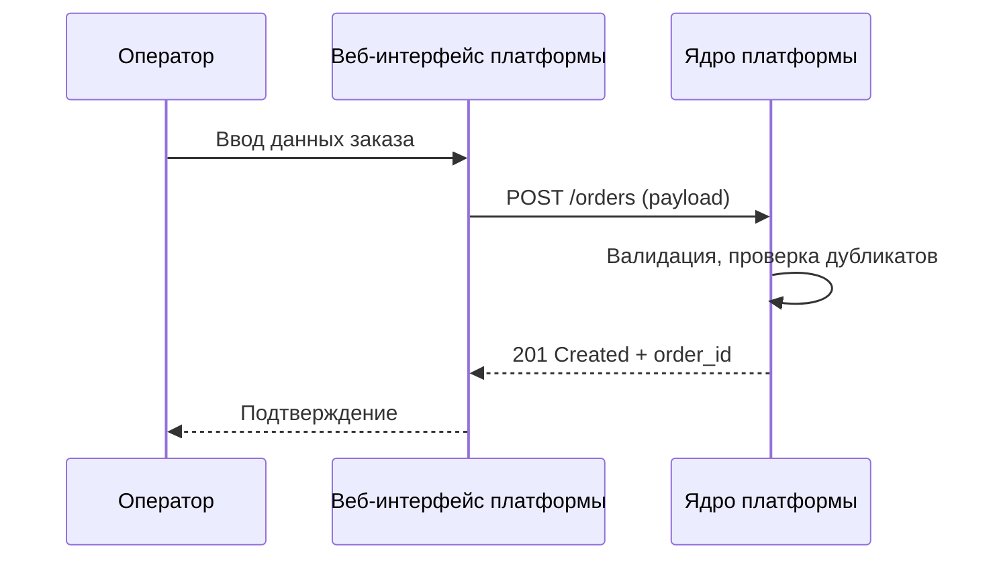
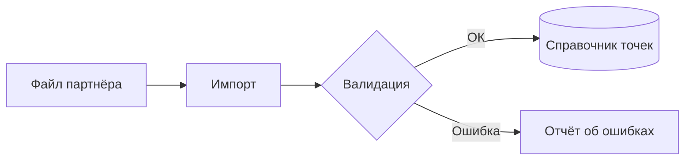
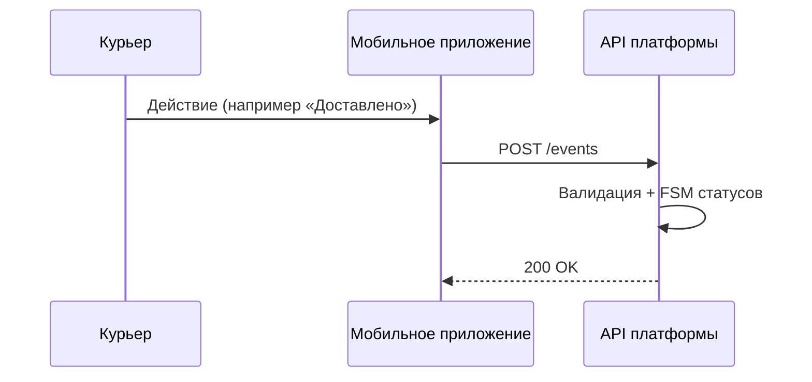
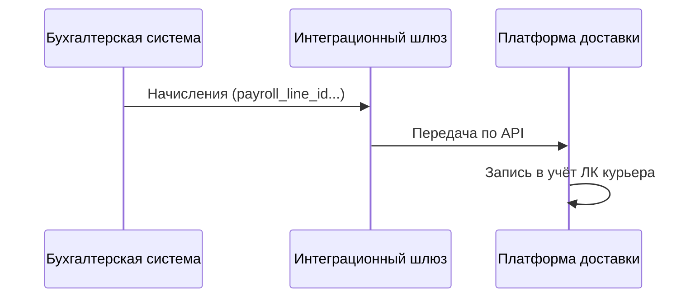
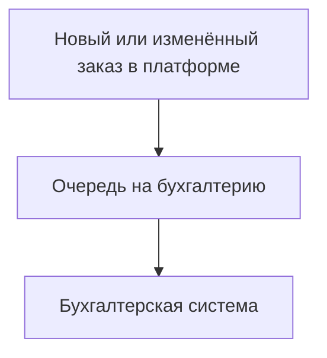
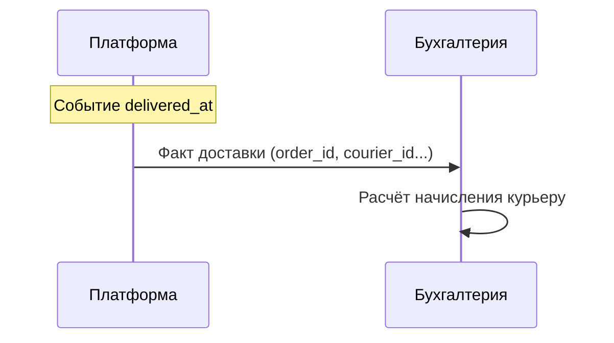
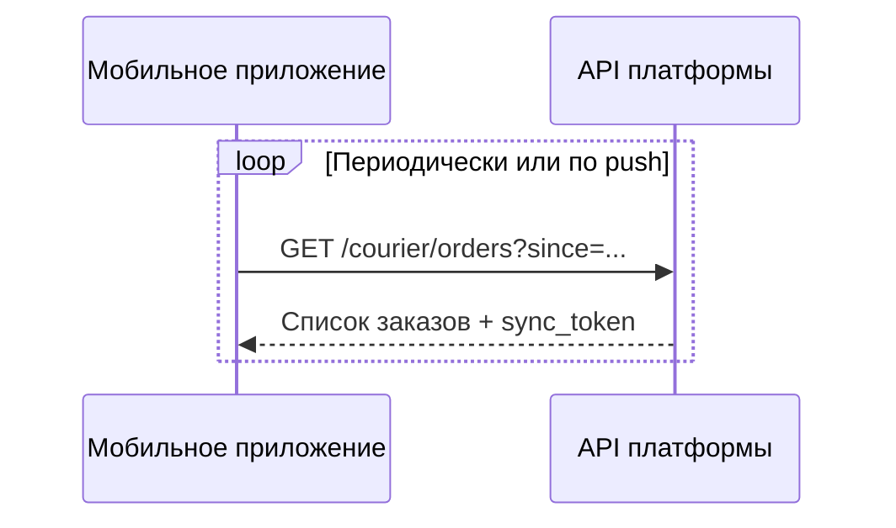

# Exercise 04 — Описание сценариев интеграции

**Задача 2. Доставка заказов.** Для каждого потока — короткий вариант использования и диаграмма в Mermaid.

---

## Поток 1. Данные о заказах (унифицированный ввод)

### UC-1. Занести заказ партнёра в платформу

| Поле | Описание |
|------|----------|
| Акторы | Оператор службы доставки, платформа доставки |
| Предусловия | Оператор вошёл в систему; партнёр уже есть в справочнике |
| Основной сценарий | Оператор достаёт заказ из канала партнёра (их ИС, почта, документ). Открывает нашу форму, заполняет поля по словарю. Система проверяет пару external_order_id + partner_id на дубликаты. Если всё чисто — сохраняет заказ, его можно отдавать в работу диспетчеру. |
| Альтернатива А1 | Такой заказ уже есть — сохранить нельзя, показываем существующий order_id |
| Постусловия | Заказ в статусе «принят»; дальше он может уйти в поток 5 по вашему регламенту |

---

## Поток 2. Справочник адресов комплектации

### UC-2. Единоразово загрузить адреса точек комплектации

| Поле | Описание |
|------|----------|
| Акторы | Администратор, платформа доставки |
| Предусловия | На руках файл или выгрузка от партнёра |
| Основной сценарий | Загрузка файла → разбор строк → проверка, что location_id не дублируются и координаты адекватные → запись в справочник, версию справочника поднимаем |
| Постусловия | Точки можно выбирать при вводе заказа из потока 1 |

---

## Поток 3. События и статусы курьера

### UC-3. Передать событие по заказу из мобильного приложения

| Поле | Описание |
|------|----------|
| Акторы | Курьер, мобильное приложение, платформа доставки |
| Предусловия | Курьер залогинен; заказ либо уже ему навешан, либо доступен по правилам брони |
| Основной сценарий | Действие в МП → отправка события с event_id → платформа проверяет, можно ли такой переход статуса → сохранение. Если это успешное «доставлено», дальше может сработать поток 6 |
| Расширение Е1 | Пришёл тот же event_id второй раз — отвечаем «уже обработано», чтобы не двоить выплаты |

---

## Поток 4. Начисленная оплата курьеру

### UC-4. Загрузить начисления из бухгалтерской системы в ЛК

| Поле | Описание |
|------|----------|
| Акторы | Бухгалтерская система, платформа доставки; курьер потом смотрит ЛК |
| Предусловия | Есть канал между бухгалтерией и платформой (API или файл по расписанию), доступы заведены |
| Основной сценарий | В бухгалтерии закрывают начисления → интеграционный модуль шлёт пачку на платформу → платформа матчится по courier_id и складывает суммы → курьер видит это в ЛК |

---

## Поток 5. Поступившие заказы в бухгалтерию

### UC-5. Передать сведения о принятом заказе для расчёта с поставщиками

| Поле | Описание |
|------|----------|
| Акторы | Платформа доставки, бухгалтерская система |
| Предусловия | Заказ уже лежит в платформе; для выгрузки настроены событие или расписание |
| Основной сценарий | Платформа собирает сообщение потока 5 по триггеру или таймеру → бухгалтерия принимает и заводит/правит записи по контрагенту-партнёру |

---

## Поток 6. Факт доставки в бухгалтерию

### UC-6. Передать факт доставки для расчёта с курьерами

| Поле | Описание |
|------|----------|
| Акторы | Платформа доставки, бухгалтерская система |
| Предусловия | По заказу финальный успешный статус (обычно «доставлен») |
| Основной сценарий | После UC-3 с нужным типом события платформа шлёт сообщение потока 6. Бухгалтерия на этом считает вознаграждение курьера и позже может отдать суммы обратно потоком 4 |

---

## Поток 7. Выдача заказов курьеру

### UC-7. Получить актуальный список заказов в мобильном приложении

| Поле | Описание |
|------|----------|
| Акторы | Курьер, мобильное приложение, платформа доставки |
| Предусловия | Телефон онлайн; если у вас зоны — курьер считается внутри зоны |
| Основной сценарий | МП дергает снимок или дельту по sync_token → платформа отдаёт список и статусы → экран обновляется сам или по push/polling |

